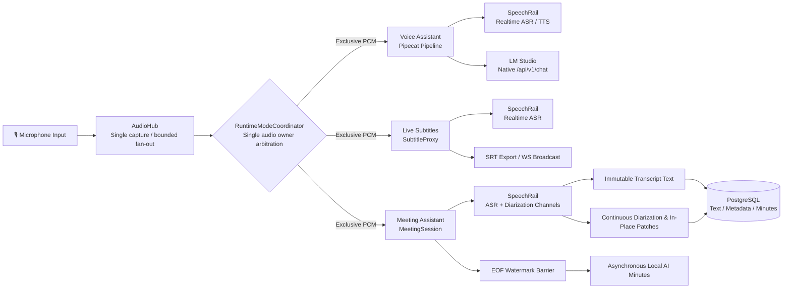

# Sona

<p align="center">
  <strong>A Sovereign, Local-First Real-Time Voice Workspace for Apple Silicon</strong><br />
  Full-Duplex Voice Assistant · Continuous Diarization Meeting Copilot · Zero-Latency Subtitles · In-Meeting Inner OS
</p>

<p align="center">
  <a href="README.md">简体中文</a> ·
  <a href="#core-capabilities">Core Capabilities</a> ·
  <a href="#quick-start">Quick Start</a> ·
  <a href="#architecture-at-a-glance">Architecture</a> ·
  <a href="docs/README.md">Documentation</a> ·
  <a href="https://github.com/hrygo/sona">GitHub</a>
</p>

<p align="center">
  <a href="https://www.python.org/downloads/"></a>
  <a href="https://developer.apple.com/macos/"></a>
  <a href="ui/package.json"></a>
  <a href="https://github.com/astral-sh/ruff"></a>
  <a href="https://mypy-lang.org/"></a>
  <a href="LICENSE"></a>
  <a href="pyproject.toml"></a>
</p>

> ⚠️ **Local Runtime Prerequisites**: Sona is deeply optimized for Apple Silicon and macOS, engineered with a 100% local-first architecture. It integrates with locally running [SpeechRail](https://github.com/hrygo/SpeechRail) (ASR / TTS / Diarization) and [LM Studio](https://lmstudio.ai/) (Local LLM Server); it is not an all-in-one monolithic package.

---

## Core Capabilities

Sona is a **Chinese-first, local-first, privacy-sovereign** real-time voice workspace. At its foundation lies the **Single Audio Ownership** paradigm: `AudioHub` captures microphone input exclusively, while the `RuntimeModeCoordinator` state machine strictly arbitrates execution between the Voice Assistant, Meeting Assistant, Live Subtitles, and Idle states—eliminating audio conflicts and resource contention.

### ✨ Five Core Pillars

- 🎙️ **Full-Duplex Voice Assistant**
  - Powered by a low-latency Pipecat streaming pipeline integrating SpeechRail Realtime ASR/TTS and native LM Studio `/api/v1/chat` inference.
  - **Dual-Layer Echo Defenses**: L1 dynamic acoustic envelope suppression (drops mic input during TTS playback with support for high-energy human Barge-in) + L2 semantic `SelfEchoFilter` text similarity matching to permanently eliminate self-trigger loops.
  - **Rolling Context Compaction (ADR-003)**: Seamless, atomic LLM response-chain swaps based on native token consumption, preserving long-term conversational memory.

- 👥 **Continuous Diarization Meeting Assistant (SPK-E2E-1)**
  - **Decoupled Dual-Channel Streaming**: Text transcription and continuous speaker diarization streams operate independently.
  - **Three Persistence Axioms**:
    1. **Immutable Transcript Text**: Confirmed transcript items (`CompletedItem`) are immutable facts;
    2. **In-Place Atomic Speaker Revisions**: Speaker attribution updates atomically as independent metadata; temporal smoothing eliminates transient jitter;
    3. **Precedence of Manual Overrides**: User corrections during or after meetings are permanently protected from automated re-tagging or EOF flushing.
  - **EOF Watermark Alignment & Local AI Minutes**: Barrier synchronization ensures full speaker alignment at session conclusion before asynchronously generating structured meeting summaries.

- ⚡ **Zero-Latency Live Subtitles**
  - Instantaneous streaming transcription overlay with millisecond-grade WebSocket client broadcasting.
  - **Lossless Reconnect**: Active-snapshot PCM replay ensures zero word loss across network interruptions.
  - One-click export of standard `.srt` subtitle files upon completion.

- 🧠 **In-Meeting Inner OS (Tactical Private Copilot)**
  - Instantly accessible during meetings via a dedicated keyboard shortcut, sliding out a golden-ratio side panel.
  - Streams real-time situation analyses, fact checks, and tailored reply drafts.
  - **Ephemeral by Default**: Pre-meeting briefs and live inferences reside purely in browser memory and self-destruct upon meeting termination unless explicitly persisted.

- 🛡️ **Data & Privacy Sovereignty**
  - **Zero Audio on Disk**: PostgreSQL stores only structured text facts, speaker mappings, and minutes. Raw microphone audio is never written to disk.
  - **Local Loopback Boundary**: Defaults strictly to loopback (`127.0.0.1`), with zero external telemetry, cloud analytics, or unauthorized network calls.
  - **Hardened Recovery Journal**: Emergency crash journals enforce strict `0700/0600` permissions and are permanently destroyed immediately upon replay.

---

## Architecture at a Glance



> ℹ️ **Design References**: For in-depth technical specifications on continuous diarization negotiation, immutable transcripts, and the EOF barrier, refer to the [SPK-E2E-1 Design Specification](docs/architecture/speaker-diarization-e2e-design.md) and the [System Architecture Document](docs/architecture/系统总体架构与详细设计方案.md).

---

## Requirements

| Dependency | Specification | Role & Purpose |
|---|---|---|
| **Hardware & Platform** | Apple Silicon (M-series Mac); macOS 14+ | Metal/NEON acceleration and unified memory; loopback audio helper requires macOS 14.2+ |
| **Python** | `==3.12.*` (Strictly pinned) | Managed via [`uv`](https://docs.astral.sh/uv/) for reproducible virtual environments |
| **Frontend Tooling** | Node.js `^20.19.0` or `>=22.12.0`, npm | Required to build the React 19 + Vite 7 web console |
| **Database** | PostgreSQL 14+ | Persists structured meeting records (DSN: `postgresql:///knowledge`, schema: `sona`) |
| **SpeechRail** | Standalone local service (Default port: `8201`) | Provides streaming ASR, TTS, and diarization; health check: `http://127.0.0.1:8201/health` |
| **LM Studio** | Standalone local service (Default port: `1234`) | Hosts local LLM inference; recommended model: `local/kat-coder-2.5` |

> 💡 **Permission Note**: Before launching Sona, verify that macOS has granted **Microphone Access** to your terminal emulator or application in System Settings.

---

## Quick Start

Execute the following commands from the repository root:

### 1. Clone & Install Dependencies

```bash
git clone https://github.com/hrygo/sona.git
cd sona

# 1.1 Install Python runtime and all dependency groups (including interaction and dev)
uv sync --all-extras

# 1.2 Install frontend dependencies and build production assets
npm --prefix ui ci
npm --prefix ui run build

# 1.3 Download NLTK punkt_tab tokenizer data for Pipecat TTS sentence boundary detection
bash scripts/install-nltk-data.sh
```

### 2. Prepare Local Dependencies

1. **Launch SpeechRail**: Configure and start your ASR, TTS, and Diarization profile (e.g. Sortformer);
2. **Launch LM Studio**: Load your preferred LLM model and start the Local Server on port `1234`;
3. **Bootstrap PostgreSQL Database**:
   ```bash
   psql knowledge -f scripts/bootstrap-meeting-db.sql
   ```
4. **Verify Service Health**:
   ```bash
   curl http://127.0.0.1:8201/health
   curl http://127.0.0.1:1234/v1/models
   ```

### 3. Launch Sona

We recommend using the unified service manager `scripts/sona-ctl.sh`:

```bash
# Option A: Run in the foreground (inspect logs directly; press Ctrl+C to exit)
scripts/sona-ctl.sh start

# Option B: Run in the background as a daemon
scripts/sona-ctl.sh start -d
scripts/sona-ctl.sh status      # Inspect service health and listening ports
scripts/sona-ctl.sh logs -f     # Follow runtime logs
scripts/sona-ctl.sh stop        # Stop the background process
```

Once running, navigate to <http://127.0.0.1:8100> in your browser to enter the Web Console.

> 💡 **LAN Access Tip**: To allow access from other devices on your local network, specify the binding mode:
> ```bash
> SONA_BIND_HOST=lan scripts/sona-ctl.sh start
> ```

---

## Usage

### Web Console

The Web Console features a global keyboard shortcut system designed for hands-free workflow during meetings:

| Shortcut | Action | Scope & Details |
|---|---|---|
| <kbd>⌘</kbd> / <kbd>Ctrl</kbd> + <kbd>1</kbd> | **Switch to Voice Assistant** | Activates full-duplex conversational voice mode |
| <kbd>⌘</kbd> / <kbd>Ctrl</kbd> + <kbd>2</kbd> | **Switch to Meeting Assistant** | Launches or switches to the real-time meeting dashboard |
| <kbd>⌘</kbd> / <kbd>Ctrl</kbd> + <kbd>3</kbd> | **Switch to Live Subtitles** | Enters fullscreen/banner streaming subtitle view |
| <kbd>⌘</kbd> / <kbd>Ctrl</kbd> + <kbd>K</kbd> | **Toggle Inner OS Panel** | Active during meetings; opens the private tactical copilot panel |
| <kbd>?</kbd> | **Keyboard Shortcut Guide** | Opens the global shortcuts and navigation overlay |
| <kbd>Esc</kbd> | **Return to Live Session** | Exits historical session review and returns to the active recording |

> When entering meeting mode, the Voice Assistant is suspended and microphone ownership transitions to the meeting engine. Ending a session triggers an EOF barrier flush before archiving the final transcript and speaker attribution.

### Headless CLI Interaction

To interact with Sona purely from the terminal without opening a browser, stop `sona-ui` and run the interactive CLI:

```bash
uv run sona-interact
# or
scripts/run-interact.sh
```

> `sona-ui` and `sona-interact` share an OS-level runtime lock file (`flock`), preventing concurrent microphone contention.

---

## Configuration

Configuration is validated via modular `pydantic-settings` classes and can be customized via a `.env` file at the repository root. Key options:

| Environment Variable | Default | Description |
|---|---|---|
| `SONA_BIND_HOST` | `127.0.0.1` | Network binding interface (`127.0.0.1`, `lan`, or `0.0.0.0`) |
| `SONA_UI_PORT` | `8100` | Web Console HTTP & WebSocket port |
| `SONA_SUBTITLE_SPEECHRAIL_URL` | `ws://127.0.0.1:8201/v1/realtime` | WebSocket endpoint for Subtitle and Meeting ASR |
| `SONA_INTERACTION_SPEECHRAIL_REALTIME_URL` | `ws://127.0.0.1:8201/v1/realtime` | WebSocket endpoint for Voice Assistant ASR/TTS |
| `SONA_INTERACTION_LLM_BASE_URL` | `http://localhost:1234/v1` | LM Studio base URL for the Voice Assistant |
| `SONA_INTERACTION_LLM_MODEL` | `local/kat-coder-2.5` | Voice Assistant LLM model identifier |
| `SONA_MEETING_DATABASE_URL` | `postgresql:///knowledge` | PostgreSQL DSN for meeting persistence |
| `SONA_MEETING_SCHEMA` | `sona` | Isolated database schema for meeting tables |
| `SONA_MEETING_DIARIZATION_EXTENSIONS_ENABLED` | `false` | Enable continuous diarization protocol extensions |
| `SONA_MEETING_INNER_OS_ENABLED` | `false` | Enable the in-meeting Inner OS side panel |

> For the comprehensive configuration surface, see the [Meeting Assistant Manual](docs/manuals/会议助手后端运行与前后端联调.md). Never commit `.env` files containing real credentials to version control.

---

## Data Sovereignty & Privacy Guarantees

- **100% Offline Sovereignty**: All transcription, diarization, and LLM reasoning occur entirely on your local Apple Silicon processor. Sona transmits no external telemetry or voice recordings.
- **Zero Audio on Disk**: PostgreSQL records confirmed textual transcripts, speaker identities, and AI minutes only. Raw microphone PCM audio is never written to disk.
- **Isolated Crash Journal**: In the rare event of a database write failure, transient transcription deltas are safely queued in an isolated recovery directory locked with `0700/0600` permissions, then securely deleted upon sync replay.
- **Ephemeral Inner OS**: Tactical context cards and in-meeting LLM reasoning remain strictly within client-side memory, self-destructing upon session termination.

---

## Repository Layout

```text
sona/
├── src/sona/               # Backend core source code
│   ├── audio/              # Single-source microphone capture & bounded fan-out Hub
│   ├── asr/                # ASR unified contracts, audio chunk models & presenters
│   ├── interaction/        # Pipecat pipeline, LM Studio chaining & dual echo defenses
│   ├── meeting/            # Meeting state machine, diarization smoothing, DB & minutes
│   ├── speechrail/         # SpeechRail Realtime protocol adapters & event deserializers
│   ├── subtitles/          # Live subtitle streaming, SRT archive export & WS broadcast
│   ├── config/             # Pydantic modular type-safe configuration subsystem
│   └── ui/                 # Mode coordinator, FastAPI routes & WebSocket control gateway
├── ui/                     # React 19 + TypeScript + Vite 7 + Tailwind CSS console
├── contracts/              # Versioned OpenAPI / AsyncAPI / JSON Schema contracts & fixtures
├── scripts/                # Service management (sona-ctl.sh), DB migrations & utilities
├── docs/                   # System architecture, implementation plans & acceptance reports
├── tests/                  # Pytest unit & integration test suites
└── pyproject.toml          # PEP 621 package metadata & dependencies (hatchling)
```

---

## Development & Quality Gates

To ensure rock-solid stability across streaming audio pipelines and database persistence, strict quality gates must pass before submitting code:

```bash
# 1. Backend unit & integration test suite (requires PostgreSQL test schema; coverage > 80%)
SONA_TEST_DATABASE_URL=postgresql:///knowledge uv run pytest tests/

# 2. Python strict type checking (strict mode across src/)
uv run mypy src/

# 3. Python linting and code style
uv run ruff check src/ tests/

# 4. Frontend unit tests (Vitest)
(cd ui && npm test -- --run)

# 5. Frontend type checking and production build validation
(cd ui && npm run build)
```

> 🚨 **Caution**: Always execute test suites using an isolated PostgreSQL test schema via `SONA_TEST_DATABASE_URL`. Never target production database schemas during automated test runs.

---

## Documentation & References

- 🧭 [Documentation Hub](docs/README.md): Full technical documentation index, document lifecycle statuses, and role-based navigation.
- 🏛️ [System Architecture & Detailed Design](docs/architecture/系统总体架构与详细设计方案.md): Authoritative architectural topology, sequence diagrams, and module contracts.
- 👥 [SPK-E2E-1 Diarization Design Specification](docs/architecture/speaker-diarization-e2e-design.md): Continuous diarization, immutable text, and watermark barrier specifications.
- 📋 [SPK-E2E-1 Joint Acceptance Report](docs/operations/speaker-diarization-e2e-acceptance-2026-09-06.md): Integration test logs, coverage metrics, and verification records.
- 🛠️ [Meeting Assistant Manual](docs/manuals/会议助手后端运行与前后端联调.md): Operations guide, database setup, and end-to-end integration workflows.
- 📜 [Meeting Assistant Contracts](contracts/meeting-assistant/v1/README.md): OpenAPI / AsyncAPI specifications and test fixtures.
- 🤝 [Contributing Guide](CONTRIBUTING.md): Development environment setup, Git conventions, and PR workflows.

---

## License

Sona is licensed under the [MIT License](LICENSE).
