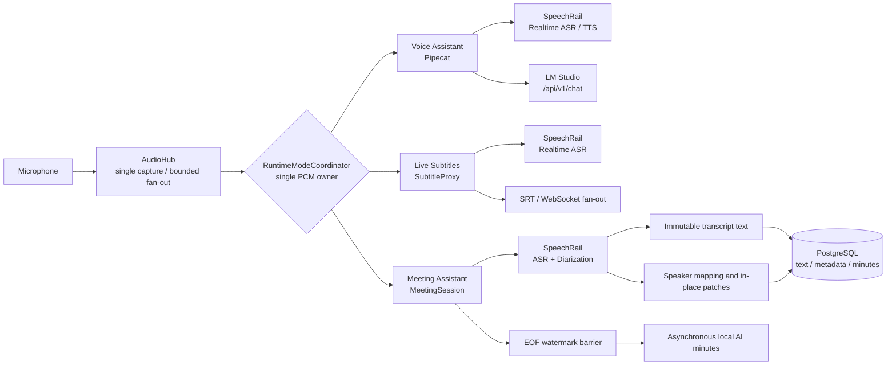

# Sona

<p align="center">
  <strong>A local real-time voice workspace for Apple Silicon</strong><br />
  Voice Assistant · Meeting Assistant · Live Subtitles · Inner OS
</p>

<p align="center">
  <a href="README.md">简体中文</a> ·
  <a href="https://github.com/hrygo/sona">GitHub</a> ·
  <a href="docs/README.md">Documentation</a>
</p>

<p align="center">
  <a href="https://www.python.org/downloads/"></a>
  <a href="https://developer.apple.com/macos/"></a>
  <a href="LICENSE"></a>
  <a href="pyproject.toml"></a>
  <a href="ui/package.json"></a>
</p>

> **Status: Beta.** Sona is currently optimized for Apple Silicon and macOS. It relies on locally running [SpeechRail](https://github.com/hrygo/SpeechRail) and [LM Studio](https://lmstudio.ai/); it is not a self-contained installer.

## Contents

- [Overview](#overview)
- [Core capabilities](#core-capabilities)
- [Architecture at a glance](#architecture-at-a-glance)
- [Requirements](#requirements)
- [Quick start](#quick-start)
- [Usage](#usage)
- [Configuration](#configuration)
- [Data and privacy boundaries](#data-and-privacy-boundaries)
- [Development and verification](#development-and-verification)
- [Repository layout](#repository-layout)
- [Documentation and collaboration](#documentation-and-collaboration)
- [License](#license)

## Overview

Sona is a Chinese-first, local-first real-time voice workspace. It brings a voice assistant, meeting transcription and diarization, live subtitles, and a private in-meeting copilot into one runtime.

Its central constraint is **single audio ownership**: `AudioHub` owns microphone PCM capture, while `RuntimeModeCoordinator` arbitrates the `assistant`, `subtitles`, `meeting`, and `idle` modes so that only one workload consumes the microphone stream at a time.

## Core capabilities

| Module | What it provides | Important boundary |
|---|---|---|
| **Voice Assistant** | SpeechRail Realtime ASR/TTS + LM Studio native `/api/v1/chat`; speaker protection, headphone duplex, Barge-in, and rolling context compaction | Voice assistant, subtitles, and meeting modes do not record concurrently |
| **Meeting Assistant** | Streaming transcription, continuous diarization, immutable transcript text, atomic speaker patches, manual override precedence, PostgreSQL persistence, EOF watermark barrier, and asynchronous AI minutes | SpeechRail owns ASR/TTS/diarization model lifecycles; Sona never stores raw audio |
| **Live Subtitles** | Low-latency subtitle rendering, WebSocket fan-out, PCM active-snapshot replay during reconnects, and SRT export | Subtitle mode owns the microphone PCM stream |
| **Inner OS** | A private side panel opened with `Cmd/Ctrl + K` for situation analysis, fact checking, and response drafts | Ephemeral by default; only explicitly saved content enters session storage |
| **Privacy first** | Loopback binding by default, local-service integration, and a crash-recovery journal with `0700/0600` permissions | First-time dependency installation and local model preparation may require network access |

## Architecture at a glance



The meeting path follows the three SPK-E2E-1 persistence axioms: confirmed transcript text is immutable, speaker attribution is revised independently in place, and manual corrections can never be overwritten by automation. See the [end-to-end design specification](docs/architecture/speaker-diarization-e2e-design.md).

## Requirements

| Dependency | Requirement |
|---|---|
| Hardware and OS | Apple Silicon Mac; macOS 14+. The optional physical-output capture helper requires macOS 14.2+ |
| Python | `>=3.12,<3.13` — Python 3.12 is pinned |
| Python tooling | [`uv`](https://docs.astral.sh/uv/) |
| Frontend tooling | Node.js `^20.19.0` or `>=22.12.0`, plus npm (Vite 7 requirement) |
| Database | PostgreSQL 14+; structured meeting data only, never raw audio |
| SpeechRail | Independent local service; default health endpoint `http://127.0.0.1:8201/health` |
| LM Studio | Independent local server; default base URL `http://127.0.0.1:1234`; recommended model `local/kat-coder-2.5` |

Grant microphone access to the terminal or application that runs Sona in macOS settings.

## Quick start

Run the following commands from the repository root.

### 1. Install dependencies

```bash
git clone https://github.com/hrygo/sona.git
cd sona

# Python dependencies: runtime, interaction, and development groups
uv sync --all-extras

# Frontend dependencies: reproducible install from the lockfile
npm --prefix ui ci

# NLTK data required for Pipecat TTS sentence splitting
bash scripts/install-nltk-data.sh

# Build the web console assets
npm --prefix ui run build
```

### 2. Prepare local services

1. Start SpeechRail and configure its ASR, TTS, and (for meetings) diarization profile.
2. Open LM Studio, load a local model, and start its Local Server.
3. Initialize PostgreSQL:

   ```bash
   psql knowledge -f scripts/bootstrap-meeting-db.sql
   ```

4. Check that the dependencies are reachable:

   ```bash
   curl http://127.0.0.1:8201/health
   curl http://127.0.0.1:1234/v1/models
   ```

### 3. Start Sona

Use the unified control script:

```bash
# Foreground process; press Ctrl+C to stop
scripts/sona-ctl.sh start

# Or run in the background
scripts/sona-ctl.sh start -d
scripts/sona-ctl.sh status
scripts/sona-ctl.sh logs -f
```

Open <http://127.0.0.1:8100> in your browser.

`scripts/run-all.sh` is a compatibility entry point equivalent to `scripts/sona-ctl.sh start`. For LAN access, set the binding mode explicitly:

```bash
SONA_BIND_HOST=lan scripts/sona-ctl.sh start
```

## Usage

### Web console

| Shortcut | Action |
|---|---|
| `⌘/Ctrl + 1` | Voice Assistant |
| `⌘/Ctrl + 2` | Meeting Assistant |
| `⌘/Ctrl + 3` | Live Subtitles |
| `⌘/Ctrl + K` | Open or close Inner OS in the Meeting Assistant |
| `?` | Open the keyboard-shortcut help |
| `Esc` | Return from history playback to the current recording view |

When meeting mode starts, the voice assistant is suspended and the meeting session owns the microphone. Ending a meeting first performs an EOF flush, then archives the final transcript and speaker state.

### Headless interaction

Stop `sona-ui` first, then run the command-line entry point:

```bash
uv run sona-interact
# or
scripts/run-interact.sh
```

`sona-ui` and `sona-interact` use a runtime lock and cannot own the interaction audio resource at the same time.

## Configuration

Configuration is managed by modular `pydantic-settings` classes and can be overridden in a repository-root `.env` file. Common settings:

| Environment variable | Default | Purpose |
|---|---|---|
| `SONA_BIND_HOST` | `127.0.0.1` | Binding mode; may be `lan` or `0.0.0.0` |
| `SONA_UI_PORT` | `8100` | Web console port |
| `SONA_SUBTITLE_SPEECHRAIL_URL` | `ws://127.0.0.1:8201/v1/realtime` | Subtitle and meeting ASR WebSocket |
| `SONA_INTERACTION_SPEECHRAIL_REALTIME_URL` | `ws://127.0.0.1:8201/v1/realtime` | Voice Assistant ASR/TTS Realtime URL |
| `SONA_INTERACTION_LLM_BASE_URL` | `http://localhost:1234/v1` | LM Studio base URL for the Voice Assistant |
| `SONA_INTERACTION_LLM_MODEL` | `local/kat-coder-2.5` | Voice Assistant model ID |
| `SONA_MEETING_DATABASE_URL` | `postgresql:///knowledge` | Meeting database DSN |
| `SONA_MEETING_SCHEMA` | `sona` | Meeting schema |
| `SONA_MEETING_DIARIZATION_EXTENSIONS_ENABLED` | `false` | Negotiate continuous diarization extensions |
| `SONA_MEETING_INNER_OS_ENABLED` | `false` | Enable Inner OS |

See the [Meeting Assistant runtime and integration manual](docs/manuals/会议助手后端运行与前后端联调.md) for the full configuration surface. Never commit real API keys, database passwords, or other credentials.

## Data and privacy boundaries

- **Local-first at runtime:** Sona defaults to loopback binding and works through local SpeechRail and LM Studio services. Sona does not intentionally upload audio, transcripts, or telemetry.
- **No raw-audio persistence:** PostgreSQL stores meeting metadata, confirmed transcripts, speaker mappings, and minutes only. Meeting capture does not write audio files or `runtime/subtitles/current.srt`.
- **Bounded recovery:** Only a temporary database-write failure records the minimum confirmed text and patch operations in the recovery journal. The directory/file permissions are `0700/0600`, and entries are removed after replay.
- **Ephemeral Inner OS:** Pre-meeting notes and in-meeting analysis normally remain in browser memory; only explicitly saved content is persisted.
- **First-time setup is different:** Installing Python/npm dependencies and obtaining local model snapshots may require network access. Fully offline runtime depends on having those services and snapshots ready beforehand.

## Development and verification

After installing development dependencies, run the project quality gates:

```bash
# Backend tests (meeting integration tests need an isolated PostgreSQL test schema)
SONA_TEST_DATABASE_URL=postgresql:///knowledge uv run pytest tests/

# Python type and style checks
uv run mypy src/
uv run ruff check src/ tests/

# Frontend tests and production build
(cd ui && npm test -- --run)
(cd ui && npm run build)
```

Use an isolated temporary PostgreSQL schema for tests; never point test settings at production data. Read the [Contributing Guide](CONTRIBUTING.md) before opening a PR.

## Repository layout

```text
src/sona/
├── audio/          # Single-source microphone capture and audio devices
├── asr/            # ASR domain contracts, models, and presenters
├── interaction/    # Pipecat voice assistant, LLM state chain, and echo barriers
├── meeting/        # Meeting state, persistence, diarization, minutes, and Inner OS
├── speechrail/     # SpeechRail Realtime ASR/TTS protocol adapters
├── subtitles/      # Live subtitles, archives, and client fan-out
├── config/         # Modular runtime configuration
└── ui/             # FastAPI/WebSocket integration layer
ui/                 # React 19 + TypeScript + Vite 7 console
contracts/          # Versioned OpenAPI/AsyncAPI/JSON Schema contracts
scripts/            # Startup, database, NLTK, and helper tools
docs/               # Architecture, manuals, decisions, and acceptance records
```

## Documentation and collaboration

- [Documentation hub](docs/README.md): complete index, lifecycle states, and role-based navigation.
- [System architecture and detailed design](docs/architecture/系统总体架构与详细设计方案.md): authoritative topology and end-to-end flows.
- [SPK-E2E-1 design specification](docs/architecture/speaker-diarization-e2e-design.md): continuous diarization and persistence axioms.
- [SPK-E2E-1 joint acceptance report](docs/operations/speaker-diarization-e2e-acceptance-2026-09-06.md): current acceptance record.
- [Meeting Assistant runtime manual](docs/manuals/会议助手后端运行与前后端联调.md): operation, database, and integration guidance.
- [Meeting Assistant contracts](contracts/meeting-assistant/v1/README.md): versioned communication contracts and fixtures.
- [Audio Capture contracts](contracts/audio-capture/v1/README.md): optional physical-output capture helper contract.
- [Contributing Guide](CONTRIBUTING.md): development setup, quality gates, commits, and PR conventions.

Use [Issues](https://github.com/hrygo/sona/issues) for reproducible bug reports and improvement proposals. Include macOS, Python, and Node.js versions plus redacted logs; never upload audio, API keys, or database credentials.

## License

Sona is released under the [MIT License](LICENSE).
