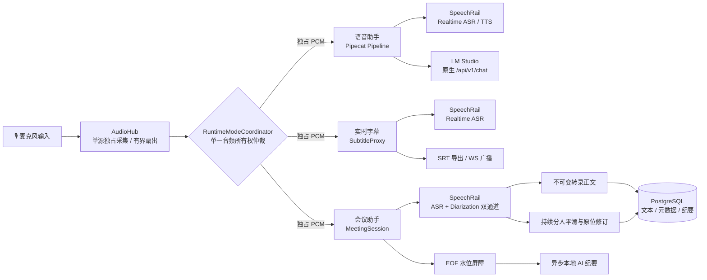

# Sona

<p align="center">
  <strong>面向 Apple Silicon 的全本地实时语音工作台</strong><br />
  全双工语音助手 · 持续分人会议助手 · 实时低延迟字幕 · 会中私密 Inner OS
</p>

<p align="center">
  <a href="README.en.md">English</a> ·
  <a href="#核心能力">核心能力</a> ·
  <a href="#快速开始">快速开始</a> ·
  <a href="#系统架构">系统架构</a> ·
  <a href="docs/README.md">文档中心</a> ·
  <a href="https://github.com/hrygo/sona">GitHub</a>
</p>

<p align="center">
  <a href="https://www.python.org/downloads/"></a>
  <a href="https://developer.apple.com/macos/"></a>
  <a href="ui/package.json"></a>
  <a href="https://github.com/astral-sh/ruff"></a>
  <a href="https://mypy-lang.org/"></a>
  <a href="LICENSE"></a>
  <a href="pyproject.toml"></a>
</p>

> ⚠️ **本地运行说明**：Sona 专为 Apple Silicon / macOS 深度调优，基于全本地离线架构构建。它依赖本机独立运行的 [SpeechRail](https://github.com/hrygo/SpeechRail)（ASR / TTS / Diarization）与 [LM Studio](https://lmstudio.ai/)（Local LLM Server），并非打包全部模型的单体黑盒。

---

## 核心能力

Sona 是一套 **中文优先、全本地、隐私主权** 的实时语音交互工作台。其底层确立了 **单一音频所有权（Single Audio Ownership）** 原则：通过 `AudioHub` 独占采集麦克风输入，并由 `RuntimeModeCoordinator` 状态机在语音助手、会议助手、实时字幕和空闲态之间严格互斥调度，杜绝音频冲突与资源踩踏。

### ✨ 五大核心支柱

- 🎙️ **全双工智能语音助手（Voice Assistant）**
  - 基于 Pipecat 实时流式管道，协同 SpeechRail Realtime ASR/TTS 与 LM Studio 原生 `/api/v1/chat` 推理。
  - **双层回声防线**：L1 声学能量包络动态抑制（丢弃 TTS 播报期输入，支持高能量真人体感 Barge-in 插话）+ L2 语义层 `SelfEchoFilter` 文本比对拦截，彻底终结自激死循环。
  - **滚动上下文压缩（ADR-003）**：根据原生 Token 吞吐自适应无感原子换链，保留长时记忆。

- 👥 **持续分人会议助手（Meeting Assistant · SPK-E2E-1）**
  - **双通道流式转录**：转录正文通道与持续说话人分离（Diarization）通道完全解耦。
  - **三大持久化公理**：
    1. **正文不可变**：已确认的转录文本单元（`CompletedItem`）具有不可变法律效力；
    2. **分人原位修订**：说话人归属作为独立元数据原子更新，时序平滑器自动消除断续毛刺；
    3. **人工更正绝对优先**：会中或会后人工指定的说话人锁定保护，绝不被后续算法或 EOF 冲刷覆盖。
  - **EOF 水位屏障与本地 AI 纪要**：会话结束优雅对齐分人水位，异步生成高精度结构化会议纪要。

- ⚡ **零延迟实时字幕（Live Subtitles）**
  - 极速流式转录上屏，毫秒级多端 WebSocket 广播与低延迟呈现。
  - **无损重连机制**：遭遇网络抖动断线时，自动重放 PCM 活跃快照，确保文字零丢失。
  - 支持会后一键导出标准 `.srt` 字幕文件。

- 🧠 **会中私密内心 OS（In-Meeting Inner OS）**
  - 会议进行中随时通过快捷键呼出私密战术侧边面板。
  - 提供多意图研判、事实核查与发言对策草稿实时流式生成。
  - **会后即焚（Ephemeral by Default）**：会前底牌与会中推演默认仅驻留浏览器端内存，会议结束即刻销毁，只有显式点击“保存”才沉淀至会话。

- 🛡️ **数据与隐私主权（Privacy Sovereign）**
  - **零音频持久化**：PostgreSQL 仅记录文本事实与纪要元数据，硬盘不持久化任何麦克风原始音频。
  - **全链路本地闭环**：默认绑定本地 Loopback（`127.0.0.1`），无任何云端依赖与数据外发。
  - **安全恢复 Journal**：意外宕机恢复日志严格锁定 `0700/0600` 文件权限，回放成功后立即安全销毁。

---

## 系统架构



> ℹ️ **设计参考**：关于持续分人协议协商、不可变正文与水位屏障的具体设计细节，请参阅 [SPK-E2E-1 端到端设计规格](docs/architecture/speaker-diarization-e2e-design.md) 与 [系统总体架构与详细设计方案](docs/architecture/系统总体架构与详细设计方案.md)。

---

## 运行要求

| 依赖组件 | 版本 / 规格要求 | 说明 |
|---|---|---|
| **硬件与平台** | Apple Silicon (M 系列芯片)；macOS 14+ | 深度利用统一内存与 Metal/NEON 加速；可选物理输出采集需 macOS 14.2+ |
| **Python** | `==3.12.*`（严格锁定） | 依赖包由 [`uv`](https://docs.astral.sh/uv/) 进行可复现管理 |
| **前端环境** | Node.js `^20.19.0` 或 `>=22.12.0`，npm | 构建 React 19 + Vite 7 控制台 |
| **数据库** | PostgreSQL 14+ | 存储会议结构化数据（DSN: `postgresql:///knowledge`，schema: `sona`） |
| **SpeechRail** | 本地服务（默认端口 `8201`） | 提供 Realtime ASR、TTS 及持续分人能力；健康检查：`http://127.0.0.1:8201/health` |
| **LM Studio** | 本地服务（默认端口 `1234`） | 提供大模型推理能力；推荐模型：`local/kat-coder-2.5` |

> 💡 **权限提示**：首次运行前，请务必在 macOS 系统偏好设置中为运行 Sona 的终端或应用授予 **麦克风访问权限**。

---

## 快速开始

以下步骤均在仓库根目录下操作：

### 1. 克隆仓库与安装依赖

```bash
git clone https://github.com/hrygo/sona.git
cd sona

# 1.1 安装 Python 运行时与全量依赖（含 interaction 与 dev）
uv sync --all-extras

# 1.2 安装前端依赖并构建生产静态资源
npm --prefix ui ci
npm --prefix ui run build

# 1.3 幂等下载 TTS 断句所需的 NLTK punkt_tab 数据
bash scripts/install-nltk-data.sh
```

### 2. 准备外部本地服务

1. **启动 SpeechRail**：加载并启动 ASR、TTS，以及会议模式所需的 Diarization Profile（如 Sortformer）；
2. **启动 LM Studio**：加载目标 LLM 模型，并启动 Local Server（默认端口 `1234`）；
3. **初始化 PostgreSQL 数据库**：
   ```bash
   psql knowledge -f scripts/bootstrap-meeting-db.sql
   ```
4. **验证依赖健康连通性**：
   ```bash
   curl http://127.0.0.1:8201/health
   curl http://127.0.0.1:1234/v1/models
   ```

### 3. 一键启动 Sona

推荐使用统一控制脚本 `scripts/sona-ctl.sh`：

```bash
# 方式 A：前台运行（可直观观察日志，按 Ctrl+C 安全退出）
scripts/sona-ctl.sh start

# 方式 B：守护进程后台运行
scripts/sona-ctl.sh start -d
scripts/sona-ctl.sh status      # 查看服务健康与端口监听
scripts/sona-ctl.sh logs -f     # 跟踪实时日志
scripts/sona-ctl.sh stop        # 停止服务
```

服务启动后，在浏览器中访问 <http://127.0.0.1:8100> 即可进入 Web 控制台。

> 💡 **局域网访问提示**：如需在局域网内其他设备上访问控制台，可显式指定绑定模式：
> ```bash
> SONA_BIND_HOST=lan scripts/sona-ctl.sh start
> ```

---

## 使用方式

### Web 控制台交互

Web 控制台内置了直观的全局键盘快捷键体系，方便在录音和会谈期间实现盲操：

| 快捷键 | 功能操作 | 作用域与行为说明 |
|---|---|---|
| <kbd>⌘</kbd> / <kbd>Ctrl</kbd> + <kbd>1</kbd> | **切换至语音助手** | 进入全双工语音交互会话模式 |
| <kbd>⌘</kbd> / <kbd>Ctrl</kbd> + <kbd>2</kbd> | **切换至会议助手** | 开启或切换至智能会议看板 |
| <kbd>⌘</kbd> / <kbd>Ctrl</kbd> + <kbd>3</kbd> | **切换至实时字幕** | 进入轻量级流式字幕全屏/条幅视图 |
| <kbd>⌘</kbd> / <kbd>Ctrl</kbd> + <kbd>K</kbd> | **呼出 / 收起 Inner OS** | 仅在会议模式有效，呼出右侧黄金比例私密研判面板 |
| <kbd>?</kbd> | **快捷键帮助中心** | 唤起全屏键盘快捷键与操作手册弹窗 |
| <kbd>Esc</kbd> | **返回实时视图** | 从历史会议回顾跳回当前正在录制的会话 |

> 进入会议模式时，系统会自动挂起语音助手链路，将麦克风 PCM 独占权切换给会议引擎；会议结束时会执行优雅 EOF 水位冲刷与分人状态封存。

### Headless 命令行交互

如需脱离浏览器纯命令行体验全双工语音交互，可停止 `sona-ui` 并启动独立交互入口：

```bash
uv run sona-interact
# 或
scripts/run-interact.sh
```

> `sona-ui` 与 `sona-interact` 共享底层运行时锁（Runtime Flock），二者互斥运行，确保不会双重占用音频采集硬件。

---

## 常用配置

配置采用模块化 `pydantic-settings` 强类型管理，可在根目录 `.env` 文件中声明覆盖。核心配置项概览：

| 环境变量 | 默认值 | 配置说明 |
|---|---|---|
| `SONA_BIND_HOST` | `127.0.0.1` | 网络绑定模式（`127.0.0.1` / `lan` / `0.0.0.0`） |
| `SONA_UI_PORT` | `8100` | Web 控制台 HTTP 与 WebSocket 端口 |
| `SONA_SUBTITLE_SPEECHRAIL_URL` | `ws://127.0.0.1:8201/v1/realtime` | 字幕与会议 ASR 流式 WebSocket 地址 |
| `SONA_INTERACTION_SPEECHRAIL_REALTIME_URL` | `ws://127.0.0.1:8201/v1/realtime` | 语音助手 ASR/TTS WebSocket 地址 |
| `SONA_INTERACTION_LLM_BASE_URL` | `http://localhost:1234/v1` | LM Studio 本地推理端点 URL |
| `SONA_INTERACTION_LLM_MODEL` | `local/kat-coder-2.5` | 交互助手推理模型 ID |
| `SONA_MEETING_DATABASE_URL` | `postgresql:///knowledge` | 会议持久化 PostgreSQL DSN |
| `SONA_MEETING_SCHEMA` | `sona` | 会议表所在隔离 Schema |
| `SONA_MEETING_DIARIZATION_EXTENSIONS_ENABLED` | `false` | 是否启用与 SpeechRail 的持续分人扩展协商 |
| `SONA_MEETING_INNER_OS_ENABLED` | `false` | 是否开启会中 Inner OS 战术侧边面板 |

> 完整参数规格与高级调优请参阅 [会议助手后端运行与前后端联调手册](docs/manuals/会议助手后端运行与前后端联调.md)。切勿将含有敏感密钥的 `.env` 提交到公开版本库。

---

## 数据边界与隐私承诺

- **100% 离线主权**：运行时默认仅绑定本机回环地址（Loopback），所有推理和转录运算均闭环发生在本机 Apple Silicon 芯片上，不包含任何云端传输或遥测追踪逻辑。
- **零音频落盘存储**：PostgreSQL 仅结构化存储会议转录文本、说话人 ID 及纪要摘要，绝不将麦克风原始音频保存至磁盘。
- **故障恢复隔离 Journal**：仅在数据库遭遇突发异常写入阻塞时，在本地暂存转录单元增量。目录与文件权限分别锁定为 `0700` 和 `0600`，重放对齐后立即安全粉碎删除。
- **Inner OS 会后即焚**：会前底牌提示词、会中即时推演草稿默认仅驻留于前端单次会话内存中，会议结束后瞬间随上下文重置清空。

---

## 工程结构

```text
sona/
├── src/sona/               # 后端核心源码
│   ├── audio/              # 单源麦克风采集、硬件探测与有界扇出 Hub
│   ├── asr/                # ASR 统一契约、音频切片模型与文本呈现器
│   ├── interaction/        # Pipecat 全双工语音交互管道、LM Studio 链与双层防回声
│   ├── meeting/            # 会议状态机、持续分人平滑、PostgreSQL 仓储与 AI 纪要
│   ├── speechrail/         # SpeechRail Realtime ASR/TTS 协议适配与事件解析
│   ├── subtitles/          # 实时字幕引擎、SRT 归档导出与客户端广播池
│   ├── config/             # Pydantic 强类型配置子系统
│   └── ui/                 # 统一模式协调器、FastAPI / WebSocket 控制网关
├── ui/                     # React 19 + TypeScript + Vite 7 + Tailwind CSS 前端控制台
├── contracts/              # OpenAPI / AsyncAPI / JSON Schema 版本化规范与 Fixtures
├── scripts/                # 服务统管 (sona-ctl.sh)、数据库迁移与自动化工具
├── docs/                   # 架构白皮书、实施方案、操作手册与联合验收记录
├── tests/                  # Pytest 单元与集成测试套件
└── pyproject.toml          # PEP 621 项目元数据与依赖定义 (hatchling)
```

---

## 开发与质量门禁

为保障核心音频流与会议持久化的强可靠性，本项目实施严格的代码质量门禁。所有 PR 在合并前必须全绿通过：

```bash
# 1. 后端单元与集成测试（需配置 PostgreSQL 测试 schema；覆盖率门禁 > 80%）
SONA_TEST_DATABASE_URL=postgresql:///knowledge uv run pytest tests/

# 2. Python 严格类型检查（strict 模式，src/ 全覆盖）
uv run mypy src/

# 3. Python 代码风格与 Lint 检查
uv run ruff check src/ tests/

# 4. 前端单元测试（Vitest）
(cd ui && npm test -- --run)

# 5. 前端类型检查与生产构建验证
(cd ui && npm run build)
```

> 🚨 **重要警告**：运行自动化测试时，必须通过 `SONA_TEST_DATABASE_URL` 指定专属的隔离测试数据库环境，**严禁将测试配置指向生产业务数据**。

---

## 拓展文档与参考

- 🧭 [文档中心总览 (Documentation Hub)](docs/README.md)：系统技术文档索引、生命周期状态对照表与角色导航矩阵。
- 🏛️ [系统总体架构与详细设计方案](docs/architecture/系统总体架构与详细设计方案.md)：权威架构拓扑、全链路时序图与设计规格。
- 👥 [SPK-E2E-1 持续分人端到端设计规格](docs/architecture/speaker-diarization-e2e-design.md)：持续分人双通道、不可变正文与水位屏障核心规范。
- 📋 [SPK-E2E-1 端到端联合验收报告](docs/operations/speaker-diarization-e2e-acceptance-2026-09-06.md)：真实联调记录、覆盖率及全绿验收证据。
- 🛠️ [会议助手后端运行与前后端联调手册](docs/manuals/会议助手后端运行与前后端联调.md)：接口定义、数据库治理与端到端联调指南。
- 📜 [Meeting Assistant 规范契约](contracts/meeting-assistant/v1/README.md)：OpenAPI / AsyncAPI 规范与通信 Fixtures。
- 🤝 [贡献指南 (Contributing Guide)](CONTRIBUTING.md)：开发环境配置、Git Commit 规范与 PR 提交流程。

---

## 许可证

本项目基于 [MIT License](LICENSE) 协议开源。
