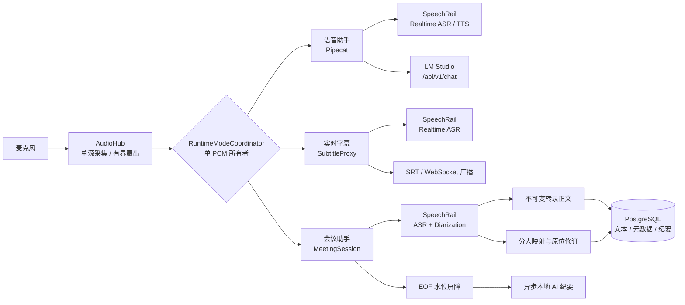

# Sona

<p align="center">
  <strong>面向 Apple Silicon 的本地实时语音工作台</strong><br />
  实时语音助手 · 智能会议助手 · 实时字幕 · 会中 Inner OS
</p>

<p align="center">
  <a href="README.en.md">English</a> ·
  <a href="https://github.com/hrygo/sona">GitHub</a> ·
  <a href="docs/README.md">文档中心</a>
</p>

<p align="center">
  <a href="https://www.python.org/downloads/"></a>
  <a href="https://developer.apple.com/macos/"></a>
  <a href="LICENSE"></a>
  <a href="pyproject.toml"></a>
  <a href="ui/package.json"></a>
</p>

> **状态：Beta。** Sona 当前面向 Apple Silicon / macOS 优化。它依赖本机运行的 [SpeechRail](https://github.com/hrygo/SpeechRail) 与 [LM Studio](https://lmstudio.ai/)，不是开箱即用的单体安装包。

## 目录

- [项目简介](#项目简介)
- [核心能力](#核心能力)
- [架构概览](#架构概览)
- [运行要求](#运行要求)
- [快速开始](#快速开始)
- [使用方式](#使用方式)
- [配置](#配置)
- [数据与隐私边界](#数据与隐私边界)
- [开发与验证](#开发与验证)
- [仓库结构](#仓库结构)
- [文档与协作](#文档与协作)
- [许可证](#许可证)

## 项目简介

Sona 是一套中文优先、全本地优先的实时语音工作台：将语音助手、会议转录与说话人分离、实时字幕和会中私密副驾驶统一到一个运行时中。

它的核心约束是 **单一音频所有者**：`AudioHub` 独占采集麦克风 PCM，`RuntimeModeCoordinator` 在 `assistant`、`subtitles`、`meeting` 与 `idle` 模式之间仲裁，避免多个任务同时消费同一条音频流。

## 核心能力

| 模块 | 能力 | 关键边界 |
|---|---|---|
| **语音助手** | SpeechRail Realtime ASR/TTS + LM Studio 原生 `/api/v1/chat`；支持外放保护、耳机双工、Barge-in、上下文滚动压缩 | 语音助手、字幕和会议模式不并行录音 |
| **会议助手** | 流式转录、持续说话人分离、不可变正文、原子分人修订、人工更正优先、PostgreSQL 持久化、EOF 水位屏障、异步 AI 纪要 | SpeechRail 负责 ASR/TTS/Diarization 模型生命周期；Sona 不保存原始音频 |
| **实时字幕** | 低延迟字幕上屏、WebSocket 广播、断线重连期间 PCM 活跃快照重放、SRT 导出 | 字幕模式独占麦克风 PCM |
| **会中 Inner OS** | `Cmd/Ctrl + K` 呼出私密侧边面板，提供局势研判、事实核查和回应草稿 | 默认会后即焚；只有用户主动保存的内容才进入会话存储 |
| **隐私优先** | 默认 loopback 绑定；本地服务协作；故障恢复 Journal 采用 `0700/0600` 权限 | 首次安装依赖和准备本地模型快照可能需要网络 |

## 架构概览



会议模式遵循 SPK-E2E-1 三条持久化公理：已确认正文不可变、说话人归属独立原位修订、人工更正不得被自动算法覆盖。详见 [端到端设计规格](docs/architecture/speaker-diarization-e2e-design.md)。

## 运行要求

| 依赖 | 要求 |
|---|---|
| 硬件与系统 | Apple Silicon Mac；macOS 14+。可选的物理输出采集 Helper 需要 macOS 14.2+ |
| Python | `>=3.12,<3.13`，严格锁定 Python 3.12 |
| Python 工具 | [`uv`](https://docs.astral.sh/uv/) |
| 前端工具 | Node.js `^20.19.0` 或 `>=22.12.0`、npm（Vite 7 的运行要求） |
| 数据库 | PostgreSQL 14+；仅保存会议结构化数据，不保存原始音频 |
| SpeechRail | 独立本地服务，默认健康检查地址 `http://127.0.0.1:8201/health` |
| LM Studio | 独立本地 Server，默认地址 `http://127.0.0.1:1234`；推荐模型 `local/kat-coder-2.5` |

还需要为运行 Sona 的终端或应用授予 macOS 麦克风权限。

## 快速开始

以下命令均从仓库根目录执行。

### 1. 安装依赖

```bash
git clone https://github.com/hrygo/sona.git
cd sona

# Python 依赖：运行时、交互管道和开发工具
uv sync --all-extras

# 前端依赖：使用锁文件保证可复现安装
npm --prefix ui ci

# Pipecat TTS 断句所需的 NLTK 数据
bash scripts/install-nltk-data.sh

# 构建 Web 控制台静态资源
npm --prefix ui run build
```

### 2. 准备本地依赖服务

1. 启动 SpeechRail，并在其中配置 ASR、TTS 和（会议模式需要的）Diarization profile。
2. 打开 LM Studio，加载本地模型并启动 Local Server。
3. 初始化 PostgreSQL：

   ```bash
   psql knowledge -f scripts/bootstrap-meeting-db.sql
   ```

4. 确认依赖服务可达：

   ```bash
   curl http://127.0.0.1:8201/health
   curl http://127.0.0.1:1234/v1/models
   ```

### 3. 启动 Sona

推荐使用统一控制脚本：

```bash
# 前台运行，Ctrl+C 停止
scripts/sona-ctl.sh start

# 或后台运行
scripts/sona-ctl.sh start -d
scripts/sona-ctl.sh status
scripts/sona-ctl.sh logs -f
```

然后打开 <http://127.0.0.1:8100>。

`scripts/run-all.sh` 是兼容入口，等价于 `scripts/sona-ctl.sh start`。如需局域网访问，显式设置绑定模式：

```bash
SONA_BIND_HOST=lan scripts/sona-ctl.sh start
```

## 使用方式

### Web 控制台

| 快捷键 | 功能 |
|---|---|
| `⌘/Ctrl + 1` | 语音助手 |
| `⌘/Ctrl + 2` | 会议助手 |
| `⌘/Ctrl + 3` | 实时字幕 |
| `⌘/Ctrl + K` | 在会议助手中打开或收起 Inner OS |
| `?` | 打开快捷键帮助 |
| `Esc` | 从历史回溯返回当前录制视图 |

进入会议模式后，语音助手会被挂起，会议会话独占麦克风；结束会议时会先执行 EOF 优雅冲刷，再封存转录和分人终态。

### Headless 交互

停止 `sona-ui` 后，可以使用命令行入口：

```bash
uv run sona-interact
# 或
scripts/run-interact.sh
```

`sona-ui` 与 `sona-interact` 通过运行时锁互斥，不能同时持有交互音频资源。

## 配置

配置由模块化 `pydantic-settings` 管理，可在仓库根目录 `.env` 中覆盖。常用项如下：

| 环境变量 | 默认值 | 用途 |
|---|---|---|
| `SONA_BIND_HOST` | `127.0.0.1` | 绑定模式；可选 `lan` 或 `0.0.0.0` |
| `SONA_UI_PORT` | `8100` | Web 控制台端口 |
| `SONA_SUBTITLE_SPEECHRAIL_URL` | `ws://127.0.0.1:8201/v1/realtime` | 字幕与会议 ASR WebSocket |
| `SONA_INTERACTION_SPEECHRAIL_REALTIME_URL` | `ws://127.0.0.1:8201/v1/realtime` | 语音助手 ASR/TTS Realtime 地址 |
| `SONA_INTERACTION_LLM_BASE_URL` | `http://localhost:1234/v1` | 交互助手的 LM Studio 地址 |
| `SONA_INTERACTION_LLM_MODEL` | `local/kat-coder-2.5` | 交互助手模型 ID |
| `SONA_MEETING_DATABASE_URL` | `postgresql:///knowledge` | 会议数据库 DSN |
| `SONA_MEETING_SCHEMA` | `sona` | 会议表所在 schema |
| `SONA_MEETING_DIARIZATION_EXTENSIONS_ENABLED` | `false` | 是否协商持续分人扩展 |
| `SONA_MEETING_INNER_OS_ENABLED` | `false` | 是否启用 Inner OS |

完整配置与运行手册见 [会议助手后端运行与前后端联调手册](docs/manuals/会议助手后端运行与前后端联调.md)。不要将真实 API key、数据库密码或其他凭据提交到仓库。

## 数据与隐私边界

- **运行时本地优先**：Sona 默认只绑定 loopback，并通过本机 SpeechRail 与 LM Studio 工作；Sona 不主动上传音频、转录或遥测数据。
- **不保存原始音频**：PostgreSQL 只保存会议元数据、确认后的转录、说话人映射和纪要；会议采集不写入音频文件或 `runtime/subtitles/current.srt`。
- **故障恢复有界**：仅在数据库短暂写入失败时，恢复 Journal 临时记录必要的确认文本与 patch 操作；目录/文件权限分别为 `0700/0600`，回放成功后删除。
- **会后即焚**：Inner OS 的会前底牌和会中分析默认仅驻留浏览器内存；只有用户主动保存的内容才持久化。
- **首次安装例外**：安装 Python/npm 依赖及获取本地模型快照可能需要网络；运行时是否完全离线取决于外部服务和模型是否已准备好。

## 开发与验证

安装开发依赖后，可运行项目质量门禁：

```bash
# 后端测试（会议集成测试需要独立 PostgreSQL 测试 schema）
SONA_TEST_DATABASE_URL=postgresql:///knowledge uv run pytest tests/

# Python 类型与风格检查
uv run mypy src/
uv run ruff check src/ tests/

# 前端测试与生产构建
(cd ui && npm test -- --run)
(cd ui && npm run build)
```

测试数据库必须使用独立临时 schema，禁止将生产 DSN 用作测试 DSN。提交 PR 前请阅读 [贡献指南](CONTRIBUTING.md)。

## 仓库结构

```text
src/sona/
├── audio/          # 单源麦克风采集、有界扇出和音频设备
├── asr/            # ASR 领域契约、模型和呈现
├── interaction/    # Pipecat 语音助手、LLM 状态链和防回声
├── meeting/        # 会议状态机、持久化、分人、纪要和 Inner OS
├── speechrail/     # SpeechRail Realtime ASR/TTS 协议适配
├── subtitles/      # 实时字幕、归档和客户端广播
├── config/         # 模块化运行配置
└── ui/             # FastAPI/WebSocket 接入层
ui/                 # React 19 + TypeScript + Vite 7 控制台
contracts/          # 版本化 OpenAPI/AsyncAPI/JSON Schema 契约
scripts/            # 启动、数据库、NLTK 和辅助工具
docs/               # 架构、手册、决策记录和验收资料
```

## 文档与协作

- [文档中心](docs/README.md)：完整索引、生命周期状态和按角色导航。
- [系统总体架构与详细设计](docs/architecture/系统总体架构与详细设计方案.md)：权威拓扑与端到端时序。
- [SPK-E2E-1 设计规格](docs/architecture/speaker-diarization-e2e-design.md)：持续分人与持久化公理。
- [SPK-E2E-1 联合验收报告](docs/operations/speaker-diarization-e2e-acceptance-2026-09-06.md)：当前验收记录。
- [会议助手运行手册](docs/manuals/会议助手后端运行与前后端联调.md)：运行、数据库和接口联调。
- [Meeting Assistant 契约](contracts/meeting-assistant/v1/README.md)：版本化通信契约与 fixtures。
- [Audio Capture 契约](contracts/audio-capture/v1/README.md)：可选物理输出采集 Helper 契约。
- [贡献指南](CONTRIBUTING.md)：开发环境、质量门禁、提交和 PR 约定。

欢迎通过 [Issues](https://github.com/hrygo/sona/issues) 报告可复现的问题或提出改进建议。报告问题时请附上 macOS、Python、Node.js 版本和脱敏后的日志；不要上传音频、API key 或数据库凭据。

## 许可证

Sona 使用 [MIT License](LICENSE) 开源。
