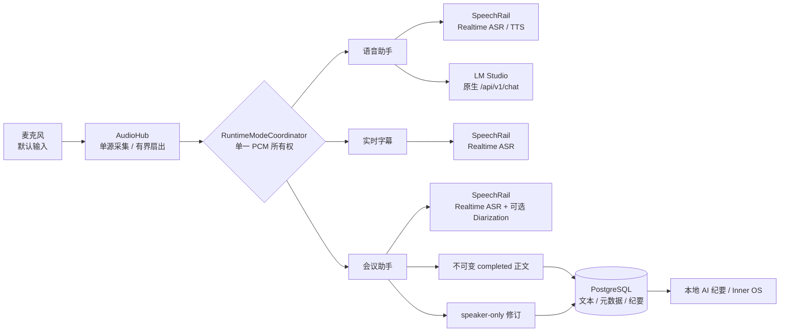

# Sona

<p align="center">
  <strong>面向 Apple Silicon 的全本地实时语音工作台</strong><br />
  语音助手 · 会议助手 · 实时字幕 · 会中 Inner OS
</p>

<p align="center">
  <a href="README.en.md">English</a> ·
  <a href="https://github.com/hrygo/sona">GitHub</a>
</p>

<p align="center">
  <a href="https://www.python.org/downloads/"></a>
  <a href="https://developer.apple.com/macos/"></a>
  <a href="ui/package.json"></a>
  <a href="https://github.com/astral-sh/ruff"></a>
  <a href="https://mypy-lang.org/"></a>
  <a href="LICENSE"></a>
  <a href="pyproject.toml"></a>
</p>

Sona 是一个中文优先、隐私优先的本地语音工作台：用同一个 Web 控制台管理实时语音对话、会议转录、说话人归属、实时字幕和会中私密研判。它针对 Apple Silicon / macOS 优化，默认把数据和推理留在本机。

Sona 是应用层，不是把模型全部打包进来的单体发行版。ASR、TTS 和 Diarization 由独立运行的 [SpeechRail](https://github.com/hrygo/SpeechRail) 提供；LLM 由本机 [LM Studio](https://lmstudio.ai/) 提供。运行时默认连接本机回环地址，不要求云端 API。

## 项目状态

| 项目 | 当前基线 |
| --- | --- |
| 发布版本 | `1.6.0` · Beta |
| 目标平台 | Apple Silicon · macOS 14+ |
| Python | `>=3.12,<3.13` |
| Realtime 协议 | SpeechRail v2 OpenAI Realtime；协议基线为 v2.0.0 |
| 最近联合验收 | 2026-09-09；本机联调服务为兼容的 SpeechRail v2.0.2 |
| 验收结论 | Sona 质量门、协议/事务、真实 meeting/subtitle smoke、字幕 clean tail 和最终 SRT 归档均通过 |

联合验收只证明 Sona 与当前 SpeechRail 服务的接线和运行边界，不等同于 SpeechRail 的 DER/cpCER、长文件、两小时资源行为或 RTTM/UEM 质量承诺。完整证据见[联合验收报告](docs/operations/speechrail-openai-diarization-integration-acceptance.md)。

## 功能概览

| 工作区 | 适合场景 | 已实现能力 |
| --- | --- | --- |
| **语音助手** | 一对一的实时语音对话 | Pipecat 全双工管道、可切换人设、预置/设计/克隆音色、音色试听、实时阶段和时延遥测；LM Studio 原生状态链；声学 + 文本双层防回声 |
| **会议助手** | 会议录制、回顾和结构化产出 | 流式转录、可选持续分人、说话人重命名、历史会议、不可变正文、AI 标题与纪要、多版本纪要、Markdown / TXT / SRT / JSON 导出 |
| **实时字幕** | 低延迟字幕和字幕归档 | SpeechRail Realtime 流式字幕、WebSocket 广播、断线重连期间的 PCM 活跃快照重放、标准 `.srt` 导出；麦克风是默认输入 |
| **Inner OS** | 会中私密事实核查和发言准备 | 事实核查、局势研判、回应草稿和证据定位；默认会后即焚，只有主动保存才进入会议存储 |

实时字幕还提供可选的 macOS 物理输出采集入口，用于把电脑播放声音送入字幕流。该能力默认关闭，需要单独构建并配置原生 `sona-audio-capture.app` Helper；它不是核心麦克风工作流的前置条件，详见[物理输出采集手册](docs/manuals/物理输出音频采集验收手册.md)。

### 声音工坊：从示例开始创建声音（开发中）

“描述声音”提供 **温柔知性、技术讲解、简报播报、有声阅读、明快陪伴、京味叙事** 六种
可编辑示例。选择后修改声音特点即可，不必从空白专业提示词写起；声音描述与实际朗读文本
分开填写，切换示例前保护已修改的内容。示例是文字起点，不是预制音频或音质保证。

新流程区分 **草稿试听 → 生成并保存参考 → 检查合成输出 → 试听实际音色 → 手动确认使用**。
录音路径保留原始音频字节与电平，允许修正实际朗读文本，不再在客户端进行整段 RMS 二次增益。
“参考已核验”不等于“输出已通过”，保存不会自动启用音色。

此增量依赖 SpeechRail 的 Quality VoiceDesign/Base 双能力及
`POST /v1/voices/designs`（[SpeechRail #46](https://github.com/hrygo/SpeechRail/pull/46)）。
旧版服务会明确提示升级，不静默回退旧提示词创建链路。真实麦克风、Safari/WebKit、模型听感和
声纹/噪声仍需独立验收。详见[声音工坊引导与双路径注册](docs/architecture/voice-studio-guided-creation.md)。

异常路径也纳入闭环：可以停止等待并核对保存结果；再次试听失败会撤销旧试听确认；启用等待服务端确认，删除失败留在弹窗重试，未提交草稿关闭前确认。详见[声音工坊 UX 分支检查矩阵](docs/architecture/voice-studio-ux-branch-audit.md)，其中浏览器测试使用实际 Sona 代理/控制链路，但音源和外部模型为测试夹具。


## 核心设计



系统最重要的边界不是某个模型，而是以下不变量：

- **一个音频所有者**：`AudioHub` 统一采集 PCM；`RuntimeModeCoordinator` 让 `assistant`、`subtitles`、`meeting` 和 `idle` 互斥，避免多个任务抢占麦克风。
- **正文与分人分离**：会议 `completed` 转录单元一旦确认，正文文本、时间、顺序和 item identity 不再被重写；说话人归属只通过 `speaker-only` patch 原位修订元数据，人工更正优先级最高。
- **不保存原始音频**：PostgreSQL 保存会议文本、说话人映射和纪要；故障恢复 Journal 只暂存数据库写入失败时的文本/patch 操作，不保存 PCM。
- **模型职责清晰**：Sona 不安装、下载或启动 ASR/TTS/Diarization 模型；SpeechRail 管理这些模型，LM Studio 负责本地 LLM 推理。

## 运行要求

| 依赖 | 要求 | 用途 |
| --- | --- | --- |
| macOS / Apple Silicon | macOS 14+，M 系列芯片 | 麦克风采集、本地推理和音频输出；首次运行需授予终端或应用麦克风权限 |
| Python | `>=3.12,<3.13` | 后端、CLI 和测试；使用 `uv` 管理环境 |
| Node.js / npm | Node.js `^20.19.0` 或 `>=22.12.0` | 构建 React 19 + Vite 7 控制台 |
| PostgreSQL | 14+ | 持久化会议、转录、说话人元数据和纪要；默认 schema 为 `sona` |
| SpeechRail | 本地服务，默认 `127.0.0.1:8201` | Realtime ASR、TTS 和可选 Diarization；检查 `/health`、`/readyz` |
| LM Studio | 本地服务，默认 `127.0.0.1:1234` | 交互、会议纪要、标题和 Inner OS 的本地 LLM；默认模型为 `local/kat-coder-2.5` |

安装依赖和 `punkt_tab` 数据时可能需要网络；应用运行时默认不依赖云端服务。SpeechRail 的模型快照由 SpeechRail 自己按其运行手册管理，Sona 不会隐式联网下载模型。

## 快速开始

以下命令均在仓库根目录执行。

### 1. 安装 Sona

```bash
git clone https://github.com/hrygo/sona.git
cd sona

# 安装 Python 运行时、交互管道和开发质量工具
uv sync --all-extras

# 安装并锁定前端依赖，构建 sona-ui 要托管的静态资源
npm --prefix ui ci
npm --prefix ui run build

# 交互模式的 Pipecat TTS 断句依赖；首次执行一次即可，脚本幂等
bash scripts/install-nltk-data.sh
```

### 2. 准备本地依赖服务

1. 启动 SpeechRail，确认 ASR/TTS 已就绪；如果要使用会议或字幕分人，再准备对应的 Diarization Profile。
2. 启动 LM Studio Local Server，加载 `local/kat-coder-2.5` 或通过环境变量指定的模型。
3. 由 PostgreSQL 管理员执行一次数据库初始化：

   ```bash
   psql knowledge -f scripts/bootstrap-meeting-db.sql
   ```

4. 检查服务是否可达：

   ```bash
   curl http://127.0.0.1:8201/health
   curl http://127.0.0.1:8201/readyz
   curl http://127.0.0.1:1234/v1/models
   ```

### 3. 启动 Web 控制台

`sona-ctl.sh` 会探测依赖、管理前后台进程、轮转日志并清理子进程。依赖探测是告警性质，不会替你启动 SpeechRail 或 LM Studio。

```bash
# 明确使用数据库应用角色；本机 PostgreSQL 认证方式不同的话按环境调整 DSN
export SONA_MEETING_DATABASE_URL=postgresql://sona_app@/knowledge
export SONA_MEETING_SCHEMA=sona

# 前台运行，按 Ctrl+C 安全退出
scripts/sona-ctl.sh start
```

浏览器打开 <http://127.0.0.1:8100>。

后台运行和常用运维命令：

```bash
scripts/sona-ctl.sh start -d
scripts/sona-ctl.sh status
scripts/sona-ctl.sh logs -f
scripts/sona-ctl.sh stop
```

默认只监听 `127.0.0.1`。如需在可信局域网访问，显式设置 `SONA_BIND_HOST=lan`；Sona 面向本机工作台设计，改变绑定地址前请评估网络暴露和数据访问风险。

## 使用方式

### Web 控制台

控制台顶部的三个工作区分别对应语音助手、会议助手和实时字幕。运行时会根据服务端权威状态自动切换：进入会议录制后，语音助手会被挂起；会议结束并完成封存后，系统回到空闲态。

常用快捷键：

| 快捷键 | 操作 |
| --- | --- |
| `⌘ / Ctrl + 1 / 2 / 3` | 切换语音助手 / 会议助手 / 实时字幕 |
| `⌘ / Ctrl + B` | 展开或折叠会议历史边栏 |
| `⌘ / Ctrl + K` | 会议中打开或收起 Inner OS；助手模式打开人设库 |
| `M` | 麦克风静音或恢复 |
| `S` | 会议录制中标记当前最新段落 |
| `⌘ / Ctrl + Shift + E / M / S` | 导出对话 Markdown / 会议纪要 Markdown / SRT |
| `?` | 打开完整快捷键速查；`Esc` 关闭弹窗、返回实时工作台或取消当前操作 |

### Headless 语音交互

不需要浏览器时，可以使用命令行交互入口。它与 `sona-ui` 共享运行时锁，启动前先停止 Web 控制台：

```bash
uv run sona-interact
# 等价入口
scripts/run-interact.sh
```

### 前端开发服务器

开发前端时，先启动后端 `sona-ui`，再启动 Vite；Vite 默认在 `5173` 将 API 和 WebSocket 代理到 `8100`：

```bash
uv run sona-ui
# 另开一个终端
npm --prefix ui run dev
```

## 常用配置

配置使用 `pydantic-settings`，可以放在根目录 `.env` 或通过环境变量注入。`.env` 已被 Git 忽略，不要提交密钥。

| 环境变量 | 默认值 | 说明 |
| --- | --- | --- |
| `SONA_BIND_HOST` | `127.0.0.1` | 全局绑定模式：`localhost`、`lan`、`0.0.0.0` 或具体地址 |
| `SONA_UI_HOST` | `127.0.0.1` | Web 控制台监听地址；优先级高于全局绑定模式 |
| `SONA_UI_PORT` | `8100` | Web 控制台和控制 WebSocket 端口 |
| `SONA_MEETING_DATABASE_URL` | `postgresql:///knowledge` | 会议 PostgreSQL DSN；生产/本机应用建议明确使用 `sona_app` |
| `SONA_MEETING_SCHEMA` | `sona` | 会议数据 schema |
| `SONA_LM_STUDIO_BASE_URL` | `http://localhost:1234/v1` | 纪要、标题、Inner OS 和交互使用的本地 LLM 端点；交互兼容变量为 `SONA_INTERACTION_LLM_BASE_URL` |
| `SONA_INTERACTION_LLM_MODEL` | `local/kat-coder-2.5` | 语音助手模型 ID |
| `SONA_MEETING_SUMMARY_MODEL` | `local/kat-coder-2.5` | 会议纪要、标题和 Inner OS 模型 ID |
| `SONA_INTERACTION_SPEECHRAIL_REALTIME_URL` | `ws://127.0.0.1:8201/v1/realtime` | 语音助手使用的 SpeechRail Realtime 地址 |
| `SONA_SUBTITLE_SPEECHRAIL_URL` | `ws://127.0.0.1:8201/v1/realtime` | 字幕和会议使用的 SpeechRail Realtime 地址 |
| `SONA_MEETING_DIARIZATION_ENABLED` | `false` | 会议 Realtime session 是否启用 SpeechRail v2 分人 opt-in |
| `SONA_SUBTITLE_DIARIZATION_ENABLED` | `false` | 实时字幕 Realtime session 是否启用 SpeechRail v2 分人 opt-in |
| `SONA_MEETING_INNER_OS_ENABLED` | `false` | 是否启用会中 Inner OS 私密通道 |
| `SONA_MEETING_INNER_OS_ANALYSIS_ENABLED` | `false` | 是否开放 Inner OS 的分析/综合研判意图 |
| `SONA_AUDIO_CAPTURE_ENABLED` | `false` | 是否启用可选 macOS 物理输出采集 Helper |
| `SONA_AUDIO_CAPTURE_HELPER_EXECUTABLE` | 未设置 | Helper 可执行文件路径；启用物理输出采集时必须配置 |

SpeechRail Realtime 地址、TTS、VAD、上下文压缩、纪要超时和恢复 Journal 等高级选项，请参阅[会议助手后端运行与前后端联调手册](docs/manuals/会议助手后端运行与前后端联调.md)。

## 数据与隐私边界

- **本地优先**：默认依赖都指向本机回环地址；在默认本地配置下，Sona 不把会议内容发送到云端，也不把模型密钥暴露给浏览器端。
- **零音频持久化**：原始麦克风/输出 PCM 不写入 PostgreSQL、会议 Journal、SRT 或应用日志。数据库只保存会议元数据、确认转录、说话人元数据、纪要和用户主动保存的 Inner OS 交换记录。
- **恢复 Journal 有界**：仅在数据库短暂写入失败时记录待回放的 confirmed 文本或 speaker patch；目录权限为 `0700`，文件权限为 `0600`，回放成功后删除。
- **Inner OS 默认即焚**：会前底牌和会中推演默认驻留在当前会话生命周期内；点击保存后才会进入 PostgreSQL，因此保存内容应按会议数据管理。
- **局域网需谨慎**：`SONA_BIND_HOST=lan` 或 `0.0.0.0` 会扩大控制台可达范围，只应在可信网络中使用，并自行配置外围访问控制。

## 面向集成方的接口

新集成请以版本化契约为准，不要依赖旧兼容入口：

- HTTP：`/api/v1/runtime`、`/api/v1/meetings` 及其 transcript/minutes/export 资源。
- 控制 WebSocket：`/ws/v1/control`，命令响应通过 `request_id` 关联。
- 会议事件 WebSocket：`/ws/v1/meetings`，连接时先接收 `meeting_snapshot` 基线。
- Inner OS 私密通道：`/ws/v1/meetings/{meeting_id}/inner-os`，仅允许 loopback 请求。

字段、事件顺序、revision 对账、错误语义和可运行 Fixtures 位于 [`contracts/meeting-assistant/v1/`](contracts/meeting-assistant/v1/)。

## 代码布局

```text
src/sona/       后端领域、运行时、SpeechRail 适配、PostgreSQL 和 API
ui/             React 19 + TypeScript + Vite 7 控制台
contracts/      OpenAPI / AsyncAPI / JSON Schema / Fixtures
scripts/        启动、数据库、NLTK 和原生音频 Helper 工具
tests/          后端单元/集成测试与契约测试
docs/           架构、运行手册、验收报告和历史决策
```

## 开发与验证

安装全部开发依赖后，提交前运行项目质量门禁：

```bash
# 后端测试；必须使用独立测试 DSN，测试会创建并清理临时 schema
SONA_TEST_DATABASE_URL=postgresql:///knowledge uv run pytest tests/

# Python strict 类型检查和 lint
uv run mypy src/
uv run ruff check src/ tests/

# 前端测试、类型检查和生产构建
(cd ui && npm test -- --run)
(cd ui && npm run build)
```

后端测试配置了分支覆盖率门槛 `fail_under=80`。不要让测试 DSN 指向包含真实会议数据的 schema；数据库集成测试必须使用独立临时 schema，并在测试结束后清理。

更完整的贡献流程、提交格式和 Pull Request 要求见 [CONTRIBUTING.md](CONTRIBUTING.md)。

## 深入阅读

- [系统总体架构与详细设计方案](docs/architecture/系统总体架构与详细设计方案.md)：全链路拓扑、状态机、时序和分层边界。
- [SpeechRail v2 分人端到端设计](docs/architecture/speaker-diarization-e2e-design.md)：双通道正文/分人修订、人工覆盖和 EOF 水位屏障。
- [会议助手运行与联调手册](docs/manuals/会议助手后端运行与前后端联调.md)：数据库、服务配置、接口和联调流程。
- [联合验收报告](docs/operations/speechrail-openai-diarization-integration-acceptance.md)：最新 Sona × SpeechRail 实测证据和验收边界。
- [文档中心](docs/README.md)：按架构、运行、契约和验收主题组织的完整文档。
- [变更日志](CHANGELOG.md)：版本和用户可见变更记录。

## 许可证

本项目基于 [MIT License](LICENSE) 协议开源。
