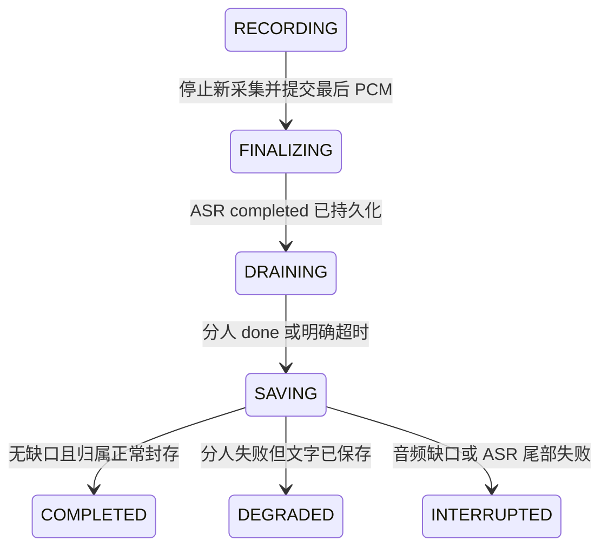

# Sona × SpeechRail 会议讲话人分离端到端设计

> 设计编号 `SPK-E2E-1`，状态为已实施。公共协议为 SpeechRail v2.0.0，当前运行时为从源码构建的 SpeechRail v2.0.3；最近验收证据见
> [2026-09-09 联合验收报告](../operations/speechrail-openai-diarization-integration-acceptance.md)。

配套：[Sona 实施计划](../superpowers/plans/2026-09-08-speechrail-openai-diarization-integration.md)。公共协议以
[SpeechRail v2.0.0 发布版本](https://github.com/hrygo/SpeechRail/releases/tag/v2.0.0)及其
[`contracts/realtime-openai.md`](../../../SpeechRail/contracts/realtime-openai.md)为准；同级检出时可打开
[SpeechRail 当前边界](../../../SpeechRail/docs/architecture/current-boundaries.md)。Sona 只消费已发布的
OpenAI Realtime 基线和 `speechrail.diarization.*` 扩展，不补造服务端事件。

## 1. 目标与职责

产品默认覆盖中文优先、1–4 位讲话人、两小时会议。用户首先看到字幕，稍后看到讲话人归属；不确定处可见且可人工更正。重叠讲话不承诺拆分成独立录音，也不凭上下文猜测待办负责人。

Sona 只做音频采集、来源/时钟映射、会议状态、业务身份、持久化和 LLM 编排。ASR/TTS 与 Sortformer
由 SpeechRail 管理；不恢复 WhisperLiveKit、Sona 本地声纹库、跨会议身份识别或本地模型 fallback。
PCM 仅在有界内存/IPC 中，数据库和 journal 不存音频/embedding；应用不启动第二个分人生产者。

| 方案 | 结论 |
|---|---|
| 流式正文 + 显式讲话人修订 + 会议内人工映射 | 采用：边界清晰、可局部重试、长会议状态有界 |
| 每句独立分人，直接复用同名 speaker 编号 | 不采用：跨 commit/重连会误合并身份 |
| 默认会末整场 batch overlay | 不采用：与无音频持久化、有界缓冲和 batch/stream 互斥相冲突 |

## 2. 当前基线和风险

协议基线为 SpeechRail v2.0.0（tag commit `33d4c316307b0d30faec726a0f72a7eb68c4196a`，
2026-09-08 发布），其 Realtime 服务使用标准 OpenAI 会话握手，并通过显式命名空间 opt-in 开启分人。
当前本地联合验收服务为从 SpeechRail 源码构建的 v2.0.3 quality release；此前 v2.0.1/v2.0.2 的 preflight 记录只作为历史部署证据保留。

| 当前事实 | 依据 | 新链路处理 |
|---|---|---|
| 标准 OpenAI Realtime 握手先于分人协商 | `speechrail/transport.py`、`transcription_events.py` | 先完成 `session.created`/标准 `session.updated`，只在显式设置开启时发送一次命名空间 opt-in |
| 分人扩展使用独立事件流 | SpeechRail v2.0.0 contract | 只接受 `speechrail.diarization.updated/status/done`，旧字面量成为协议错误 |
| completed 正文与分人归属分离 | `speechrail/transcriber.py`、`meeting/repository.py` | 正文按 item 不可变落库，更新只通过 `apply_speaker_patches` 原位修订元数据 |
| EOF 由 `done` 作为分人终态 | `speechrail/transcriber.py:finish`、`meeting/session.py` | clear/关闭前等待 `done` 及仓储水位；缺失、超时或 degraded 均可见降级 |
| 应用侧不再有第二分人生产者 | 已删除 batch overlay 与 batch transcriber | 不保存音频，不做会末批量回写，不把旧分人路径作为 fallback |

以上事实由源码、契约测试及已记录的手工 turn loopback 支撑；服务版本、运行时健康和真实音频结果以验收报告的实测记录为准。

## 3. 采集与时钟

继续使用既有 `AudioSourceRouter`/来源实现和统一模式协调，会议与助手互斥消费 PCM。支持 microphone-only、physical-output-only、dual；首期推荐双源配耳机。外放 AEC 属于单独声学验收，不通过音量门控承诺无回声，也不把系统输出重复识别成另一位真人。

新协议样本是 16 kHz mono s16le。应用累计样本再转换成毫秒，不逐包取整累加。每 source epoch 记录：

扩展会议按 Rail 回显 `max_item_duration_ms=8000` 验证上限，默认请求 server VAD（threshold=0.65、prefix_padding_ms=300、silence_duration_ms=900）；标准字幕使用相同阈值与前置缓冲，但静音窗口为 400ms；每包 20–100ms，最大 500ms。SpeechRail 的 32ms 帧会把停止边界量化到约 928ms/416ms。服务自动硬切连续讲话，Sona 不再叠加独立定时 commit 造成重复空 item。UI 将“字幕出现”“等待断句”“讲话人确认”分开呈现，不承诺每个词都在 4 秒内最终归属；完整延迟门见 Rail 规格。若服务端 VAD preflight 缺少 `onnxruntime`，连接会显式失败并按外部部署问题处理，不在 Sona 侧静默切换引擎。

```text
source_epoch: int
source_session_id: str
meeting_start_sample: int
replay_until_meeting_sample: int
last_committed_meeting_sample: int
```

`meeting_sample = meeting_start_sample + rail_session_sample`。当前协议使用服务的
`audio_start_sample/audio_end_sample`，禁止再加 VAD onset/item_offset；样本换算单位以服务回显
`sample_rate=16000` 验证。

暂停、设备切换导致实际时钟跳变、来源故障或 WebSocket 重连时，必须结束旧 source epoch，记录准确 gap 和新起点。正常静音保持源时钟，不在音频中直接删掉。mute 是否继续输入零值 PCM 由当前音频产品语义决定；若当前语义为零吞吐，则 resume 必须新 epoch，不能伪装连续录音。

### 3.1 重连重放

1. 只缓存未落库的完整 ASR item 后缀，最大 30 秒；已确认文本不重播也不重新归属。
2. 已持久化的 completed item 以 item 结尾更新 `last_committed_meeting_sample`，而不是按最后一个词的结尾更新，避免重复静音尾部。
3. 新 epoch 的 meeting_start_sample 为重放后缀真实起点。回放期间仍按原速/受控速度接受服务背压，不同时把新 PCM 插入旧序列中间。
4. replay 超过上限、旧 item 一部分已确认但源边界未知，或新结果跨越持久化 watermark：放弃该重叠部分并记录 gap，不做模糊文本去重。已有正文不能被覆盖。
5. 已落库正文但 speaker 修订未完成时，不重跑其音频；断线后保留当前归属并将未冻结归属标为 unknown/connection_lost。声学状态不可从 journal 恢复。
6. 不同 session 即使都返回 `A` 也默认是不同匿名来源；Sona 不跨 session 自动合并，也不根据声学标签推断真实身份。

## 4. 消费协议与事实模型

### 4.1 协商

配置 `SONA_MEETING_DIARIZATION_ENABLED=false` 只影响后续新会议。所有连接先完成
`session.created`、标准 `session.update` 与 `session.updated`；标准回显不得包含 `speechrail`。
显式开启时只发送一次：

```json
{"type":"session.update","session":{"speechrail":{"diarization":{"enabled":true}}}}
```

随后必须收到精确的 `session.updated.session.speechrail.diarization` 回显
`{"enabled":true,"version":1,"max_speakers":4}`。能力不可用、协商失败或运行时 degraded 时不试探其他协议，
保留已确认正文并向 UI 暴露分人不可用原因。

### 4.2 两类事实独立

`completed.transcript` 是正文事实。`attribution_units` 是对该字符串的完整 code point 范围划分（Python slice 语义）；浏览器 JS UTF-16 不能直接按此索引切字符串，后端应交付已切好的 text。

Sona 使用 `UUIDv5(meeting_id, source_session_id + ":" + segment_uid)` 生成稳定 segment UUID。新的 completed 重送只幂等确认；同源 ID 不同正文/时间/分割为协议冲突，保留原事实并中断该 epoch。新链路不再接收旧 `.segment` 双写。

新增归属领域对象：

```python
@dataclass(frozen=True)
class SpeakerPatch:
    segment_uid: str
    revision: int
    status: Literal["unknown", "tentative", "stable"]
    source_speaker: str | None
    coverage_ratio: float
    overlap_ratio: float
    candidates: tuple[tuple[str, float], ...]
```

这是 Sona 侧已实施的领域类型，不导入 SpeechRail 代码。`source_session_id` 属于外层
`SpeakerPatchEvent`，而不是单个 patch。source 字段是声学来源；应用侧 `speaker_key` 为会议内不透明 UUID
字符串，由持久化层生成；UI 不解析 key。历史行中的旧 `speaker:0` 值按 unknown 呈现，但不强制重写历史库。

文本 confirmed 可以伴随 speaker tentative/unknown。算法 stable 不等于人工确认。`timing_quality=unavailable` 表示只有 item 粗时间范围，不能以词级精度驱动跳转或计算高精度说话时长。

### 4.3 新事件的严格处理

新模式只接受三个 type：`speechrail.diarization.updated`、`speechrail.diarization.status`、
`speechrail.diarization.done`。字段限制以 Rail 规格为准；未知其他 type 仍拒绝，不能用“忽略所有未知事件”
隐藏拼写和协议错误。

- update 只能引用本连接已落库 completed 的单位；同 revision 同内容重复忽略，同 revision 不同内容报冲突，revision 倒退忽略。
- 同连接每 segment revision 必须连续；跳号/更新未知 UID 视为协议错误，停止分人、保留正文。WebSocket 正常保证顺序，因此不实现服务端事件无限补拉。
- SpeechRail 必须先发送每个单位的 revision 1 baseline，再发送后续 revision；有界队列无法保留完整修订序列时 fail closed 为 degraded，不发送会造成客户端 `revision_gap` 的跳号更新。
- `speaker=null` 只能与 `status="unknown"` 组合；不能把 `tentative/stable + null` 发送为协议事件。ForcedAligner 的量化零时长 token 会被丢弃，避免把本来可对齐的正文错误降级为整段 unavailable。
- 客户端 DB 写入暂时失败时，接收队列有界，按原顺序 journal；未持久化的 completed 在修订之前回放。
- stable watermark 单调；超过 watermark 的单元不再接受自动归属改写。人工更正不受声学 watermark 限制。
- status degraded 后所有新 unit 为 unknown，页面提示一次；不无限重连试图掩盖持续模型错误。

## 5. 持久化与人工身份

### 5.1 加法迁移

在本项目配置的 schema 内通过版本化 migration 执行；编号取实施时下一个空闲序号，不硬编码历史数据库名称/用户或复用其他项目 schema。测试使用专用临时 schema。无需 pgvector/AGE，无声纹落库。

| 对象 | 拟新增内容 |
|---|---|
| `transcript_segments` | nullable `source_session_id`/`source_segment_uid`/`source_item_id`；`speaker_revision` 默认 0；`model_speaker_key` nullable；`speaker_override_key` nullable；`speaker_status` 默认 unknown；`speaker_frozen` 默认 false；`timing_quality` 默认 unavailable；`coverage_ratio/overlap_ratio` 默认 0；`speaker_candidates` JSONB 默认空数组（最多 4 项） |
| `meetings` | `diarization_status`（off/active/complete/degraded）、`diarization_reason` nullable |
| 新表 `meeting_transcription_sources` | meeting_id、source_epoch、session_id、meeting_start_sample、last_committed_meeting_sample、stable_through_sample、last_update_sequence；每会议 session 唯一，水位保持 Rail session 时间域 |
| 新表 `meeting_speaker_sources` | meeting_id、session_id、source_speaker、application_speaker_key；源标签仅在 session 内唯一 |
| 新表 `meeting_source_events` | meeting_id、session_id、event_id、canonical_payload_hash；唯一组合用于去重，不存音频/embedding/原始消息 |

为有 source UID 的 segment 建 `(meeting_id,source_session_id,source_segment_uid)` 唯一索引；旧行 nullable，保持旧查询可用。未知显示使用保留 key `unknown`，不得出现在实名候选列表；它不是 UUID 身份。模型主 speaker 有值时解析到应用 UUID；对 legacy 字段的兼容输出由 presenter 负责。

新增所有 SQL 通过 schema-safe 的现有 repository 连接与参数化机制，不把 scheme/表名当未校验用户输入。旧程序回退仍能读取旧必填列；新增列/表不做 destructive down migration。

### 5.2 专用事务，不重用历史后缀替换

新增 port：`append_completed_item(meeting_id, item: CompletedItem) -> TranscriptReconcileResult` 与 `apply_speaker_patches(meeting_id, source_event: SpeakerPatchEvent) -> SpeakerPatchResult`，由 repository 实现。

`CompletedItem` 包含 session/item ID、顶层 event_id/sequence、session sample 区间、canonical text、immutable units
和 source epoch。`SpeakerPatchEvent` 包含 session/event ID/sequence、stable_through_sample 与 patches；候选只作为证据，
不参与身份合并。`SpeakerPatchResult` 包含 changed_segment_ids、transcript_revision、content_revision、
diarization_status。各类型先经显式转换，不能把未校验 dict 送入 repository。

speaker-only 事务步骤：

1. 锁 meeting 行；只接受 RECORDING/FINALIZING（自动修订），验证 source session 属于该 meeting。
2. 检查 source event 唯一键和内容哈希；相同 event 重放不增加版本，不新增事件。
3. 按 source UID 定位全部目标，验证 revision、不可变字段以及 watermark；任何非法目标整批拒绝，不半批写入。
4. 更新模型归属、revision、status、coverage/overlap 和候选；只有 patch 状态为 `stable` 时置位
   `speaker_frozen`，并在同事务推进 source 的 `last_update_sequence`。没有人工 override 时更新既有
   `speaker_key`；有 override 保留用户结果，模型值仅供可追溯查看。
5. 仅当有效结果变化时递增 meeting 的 transcript_revision 和 content_revision，写既有 meeting_events，并提交去重凭证；一次事务一次版本。
6. 对外广播完整一致的结果；失败则全部回滚。禁止 DELETE transcript 后缀、禁止改 text/start/end/id，也不全量重写会议。

### 5.3 名称与身份冲突

rename 是 display_name 修改，不证明声音身份，也不将所有词标为 manual。对某段人工改归属则写 speaker_override_key；“恢复自动”显式清空 override，重新使用最新 model 值。

跨 session link 到两个已命名且名称不同的应用身份时，不自动合并、不删除任一身份，记录 conflict 供人工处理。同样，存在相互矛盾的 link 时不做传递闭包。只有一端未命名时可在事务中关联其 source key 到已存在应用身份；已经存在人工 override 的段始终保持。

显式人工合并支持撤销：源身份标记 alias，不删除；记录操作 ID、受影响 segment ID 和原 key。交换 A↔B 的手动操作根据原始快照一次计算再写入，不能用循环 UPDATE 导致 A/B 都变成一个值。本期不承诺分人结束后自动重新聚类所有历史段。

### 5.4 恢复 journal

复用 `meeting/recovery.py`，新增白名单操作 `append_completed_item`、`apply_speaker_patches`、`finalize_diarization`。journal 只存恢复必需的文本/匿名归属和幂等键，延续目录 0700、文件 0600；不记录私有底牌、PCM、embedding、完整服务 raw event。

DB 恢复后严格按 completed→patch→finalize 回放，利用同一唯一键幂等。journal 有待处理内容时，会议不能标记为“已完整保存”，纪要排队暂停。容量沿用现有有界错误策略，达到限制时停止采集并报告保存失败，不能吞异常后宣称 completed。

## 6. UI 与会议封存

### 6.1 展示状态

| 状态 | 页面文案/行为 |
|---|---|
| partial text | 临时字幕，可变文本，不进入纪要 |
| confirmed + unknown | “讲话人未确定”；保留全文 |
| confirmed + tentative | “发言人 1 · 待确认”，收到 patch 原位更新 |
| confirmed + stable | “发言人 1”或用户名称；不用百分比冒充身份概率 |
| 手动更正 | 显示人工标识；后续自动 patch 不覆盖 |
| overlap | “重叠讲话”，允许展示候选，不强制一人 |
| degraded | “分人不可用，文字仍在记录”；影响区间可查 |

阅读层可合并相邻同人文字，但底层 immutable units 不合并、不改 UUID。虚拟列表 key 用 segment UUID。短词不因 350/500 ms 规则改人；speaker-only 更新不触发正文滚动重置。粗时间单元不显示伪精确词级播放定位。

后端/前端契约本期继续使用既有 `transcript_reconciled` 或 snapshot 通道传递**完整受影响后缀**，复用现有 replace_from_ms 语义；这只是 presenter 输出，不是数据库后缀删除。新增归属字段在服务器与 UI 的 schema/fixture 中同步定义；旧客户端通过现有 legacy presenter 看到原字段集合。新 UI 请求 `speaker_details=1` 的 query 参数后才接收新字段，服务不支持该参数时新 UI回到 legacy 呈现。

后端每批最多 256 个声学修订，但输出后缀可能较长；超过现有响应/队列边界时发送既有 resync-required，客户端分页重取 snapshot，不发送无限大 WS 消息。新字段不默认注入旧版本 additionalProperties=false 的 JSON schema。

### 6.2 停止会议状态机



DRAINING/SAVING/DEGRADED 是 UI/应用内部阶段，不擅自增加旧 MeetingStatus 枚举。持久状态继续 COMPLETED/INTERRUPTED，分人单独用 diarization_status 区分。仅分人失败可 `MeetingStatus.COMPLETED + diarization_status=degraded`；ASR 尾部超时使用现有 interrupted/finalization_timeout。

分人模式顺序：停止采集→commit→所有 completed 落库→消费 `updated/status`→等待 `done` 及
`last_update_sequence` 对应更新持久化→保存 complete/degraded→clear/关闭→封存会议→创建纪要任务。
总体等待上限 30 秒，不能每个步骤单独重新获得 30 秒。未开启分人时直接按标准 ASR 终态关闭，不等待分人事件。
超时不伪造 `done`；保留已落库正文并记录原因。

### 6.3 纪要和内心 OS

纪要读取固定的 transcript_revision/content_revision；提炼过程附 segment UUID 证据引用。只有 confirmed text 进入最终纪要；unknown speaker 可以总结内容，但负责人保持“待确认”，不得从称谓或第一人称推断实名。重叠且无法区分的承诺不得确定归给单人。

生成期间人工命名/归属改变会递增 content_revision。返回时若 source revision 过期，结果标为 stale，用户看到更新提示；不得将旧姓名摘要覆盖当前版本。内心 OS 可以读取临时信息，但必须携带不确定状态且保持既有会后即焚边界。本期沿用当前 LLM provider/model，不修改 LM Studio 配置。

## 7. 单一分人生产者与迁移

当前实现只把 SpeechRail v2 Realtime 分人事件转换为 speaker-only patch。旧 batch overlay、旧 batch
transcriber、旧协议字段和旧运行时开关均不在当前路径；历史迁移仅保留读取旧行所需的数据库结构。
因此不存在会末重新读取音频、覆盖实时结果或绕过人工更正的第二分人生产者。

## 8. 联合验收与发布

质量数据与目标统一采用 SpeechRail v2.0.0 contract；Sona 不维护第二套冲突阈值。必须验证：

| 用例 | 必须成立 |
|---|---|
| 第二个 commit、静音后恢复 | 时间不回零、不双加 offset、不覆盖历史 |
| 真实短会议与字幕链路 | 标准握手、显式 opt-in、completed、updated/status/done 顺序和脱敏结果成立 |
| replay/重复 event | 正文无重复、UUID 稳定、版本只加一次 |
| 迟到 speaker patch | 正文、时间、人工 override 保持，局部归属正确变化 |
| 同 source ID 内容变化/版本跳号 | 可见协议失败，不 silent overwrite |
| A/B 相似音色、A-B-A 短插话 | 不单凭时长抹掉真实插话 |
| 人工名称冲突与 A↔B 交换 | 不合并两个人，不丢姓名与原始身份 |
| DB 故障与 journal 回放 | 单次逻辑提交，文本和修订顺序正确，封存不提前 |
| finalize 丢失、延迟或 native timeout | 30 秒内可见降级/中断，不假 completed |
| 未开启分人 | 不发送 `speechrail` opt-in，不处理分人事件 |
| 扩展会议 | 不存在第二分人生产者；正文与 speaker patch 分离 |
| 摘要过程中人工纠错 | 旧 revision 的纪要标 stale，负责人不被错误归属 |

实施顺序：协议适配→加法数据迁移/幂等事务→UI/EOF/纪要→联合验收。公共机器契约仍是 SpeechRail
v2.0.0；当前受管运行时为从 SpeechRail 源码仓库构建的 v2.0.3，不能靠 mock 猜未实现接口。

发布：SpeechRail 公共协议 v2.0.0 已发布，当前 v2.0.3 运行时由源码 wheel 部署；Sona 默认仍关闭分人，按会议/字幕设置显式开启。回退时结束录音、关闭
当前设置并保留新数据列及 journal；不删除数据、不把未知改成某个人，也不恢复已删除的 batch 路径。

## 9. 本次文档交付边界

本轮已完成 SpeechRail v2.0.0 对接实施、协议/事务/UI 测试和手工 turn meeting loopback smoke；完整门禁、
真实服务版本、字幕停止链路结果与限制条件见联合验收报告。当前 SpeechRail v2.0.3 已报告 `realtime_vad`
ready，默认 server-side VAD meeting smoke、字幕重入隔离、会议正文/分人水位屏障和源码 wheel 部署链路均已复验；
此前的 clean-tail、revision 丢失、EOF 对齐和未知 speaker 回退问题已在当前联合验收中关闭。若后续运行时再次缺少
`onnxruntime`，请求 server-side VAD 仍应显式 preflight 失败，不在 Sona 侧静默切换引擎。
