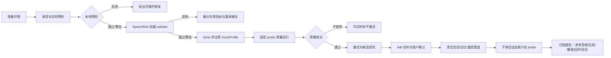

# Sona 克隆音色质量闭环与声音工坊自量保障设计

## 1. 摘要

本方案解决以下完整场景，而不是只修复某一个试听接口：

1. 在声音工坊朗读“浩瀚星空无垠深邃……”并创建 clone 音色；
2. 立即试听 clone；
3. 清空会话、清空记忆、重启管道；
4. 询问“请进行自我介绍”；
5. 判断回答中的背景噪声到底来自参考录音、SpeechRail 生成、Sona 播放/回声链路，还是会话状态。

核心原则是“服务端权威质量、客户端即时反馈、跨服务可归因、原始音频不落 Sona”。Sona 负责录音环境、用户体验、模式所有权、播放安全和诊断编排；SpeechRail 负责参考音频校验、克隆模型、生成输出质量和权威质量报告。

当前已有的声音工坊接线和 clone 响度修复计划继续有效；本文件补齐其上层质量闭环、UI/UX 和自量保障，不改变已有 OpenAI 兼容协议及 SpeechRail 模型所有权。

## 2. 范围与非目标

### 2.1 目标

- 在录音提交前尽早发现静音、削波、底噪、混响、过短、语音覆盖不足和参考文本不匹配。
- 克隆完成后，用固定 probe 文本自动生成可重复的质量证据，并明确区分“可试听”和“推荐作为助手默认音色”。
- 清空会话、清空记忆、重启管道后，验证音色选择、响应链、播放链和回声防线仍处于干净状态。
- 给用户可操作的修复建议，而不是只显示“克隆失败”或“声音很吵”。
- 为 Sona、SpeechRail、人工试听和后续 issue 提供同一份 `run_id` 关联证据。

### 2.2 非目标

- Sona 不安装、下载或启动本地 ASR/TTS 模型。
- Sona 不保存原始参考音频、TTS PCM、完整响度序列或用户文本日志。
- 不在 Sona 侧逐个 80 ms chunk 做独立归一化，也不叠加第二个快速 AGC。
- 不在同一变更中升级 Qwen3-TTS、切换量化档位或重写实时管道。
- 不把“清空记忆”当成音频质量修复；它只负责清理会话语义状态。

## 3. 跨仓库职责边界

| 能力 | Sona | SpeechRail | 权威方 |
|---|---|---|---|
| 麦克风权限、设备选择、录音计时 | 负责 | 不参与 | Sona |
| 录音时的实时电平、底噪基线、削波提示 | 负责即时提示 | 可复核 | SpeechRail 复核 |
| 音频解码、mono/24 kHz/PCM16 标准化 | 不落盘处理，仅可做 UX 预检 | 负责并拒绝不合格输入 | SpeechRail |
| 参考音频质量门禁 | 展示结果 | 计算并决定是否允许 clone | SpeechRail |
| clone 模型、reference cache、输出响度 | 消费结果 | 负责 | SpeechRail |
| 试听与默认助手播放 | 负责播放、取消、回声防线 | 提供有序 PCM | Sona 播放链 |
| 固定 probe 质量运行 | 触发、展示、保存 run 摘要 | 执行生成、计算指标 | SpeechRail |
| 会话/记忆清空与管道重启 | 负责状态机和证据关联 | 提供无状态/会话能力 | Sona |
| 原始音频与敏感数据生命周期 | 禁止持久化 | 受控目录短期保存 reference；日志脱敏 | 各自边界 |

## 4. 端到端闭环



每次录音和每次质量运行都有 `run_id`。Sona 只保存诊断摘要和状态，不保存音频；SpeechRail 返回 `quality_report` 和稳定错误码。一个 clone 在“可用”之外再区分“未评估、质量良好、存在风险、不建议默认使用”。

## 5. Sona UI/UX 设计

> **当前落地（2026-09-09）**：Sona 已实现浏览器侧录音预检、质量报告消费、clone 后质量运行、候选音色保护，以及助手面板中的“克隆音色验收”串行诊断。SpeechRail 的权威 `validate`、更完整的播放前/播放后 PCM 证据和真实扬声器验收仍由 [SpeechRail #36](https://github.com/hrygo/SpeechRail/issues/36) 跟踪；因此旧服务端或证据不完整时 UI 明确显示“尚未评估/证据不足”，不判定为通过。

### 5.1 五步向导

#### Step 1：准备环境

显示麦克风、输入采样率、输入通道、当前模式和输出设备。用户必须看到：

- 建议戴耳机或暂时静音助手；
- 麦克风距离约 15–20 cm，避免桌面震动和风噪；
- 录音文本会用于克隆参考，不会上传到 Sona 的持久化存储；
- 当前会话/会议占用 PCM 时，按钮显示“等待空闲”，而不是让用户点击后再失败。

#### Step 2：录音

录音面板同时显示波形和简化的质量仪表：`语音覆盖`、`背景噪声`、`削波`、`有效时长`。实时状态分为 `检测中`、`良好`、`偏吵`、`过载`、`未检测到人声`。颜色不是唯一信号，必须配合图标和文字。

录音期间：

- 暂停助手 TTS 播放，取得 `voiceRecordingMicLease`；
- 记录本地 `run_id`、设备摘要和统计窗口，不记录 PCM；
- 允许重录，保留最近一次录音预览，但不自动覆盖上一次已通过的音色。

#### Step 3：质量检查

上传前先给“本地快速预检”，再进入“SpeechRail 权威检查”。预检结果只作为用户体验提示，不允许绕过服务端门禁。

质量卡片每项都显示：状态、实测值、建议范围、修复动作。示例：

| 指标 | 通过 | 警告 | 拒绝 | 用户动作 |
|---|---:|---:|---:|---|
| 有效时长 | 4–30 s | 2–4 s 或 30–45 s | <2 s 或 >45 s | 重新录完整句子 |
| 背景噪声 | ≤ -45 dBFS | -45～-35 dBFS | > -35 dBFS | 关闭风扇/键盘，靠近麦克风 |
| 估算 SNR | ≥20 dB | 15–20 dB | <15 dB | 换安静环境 |
| 削波比例 | <0.01% | 0.01–0.1% | >0.1% | 降低输入增益 |
| 首尾静音 | ≤0.8 s | 0.8–1.5 s | >1.5 s | 重新按提示开始/结束 |
| 文本匹配 | ≥98% | 90–98% | <90% | 按原文重读 |

阈值是 `voice_quality_v1` 策略的初始产品门槛，不宣称为模型官方硬限制；上线后用真实样本校准，策略版本必须进入报告。

#### Step 4：生成与质量验收

clone 成功后进入独立的“音色验收”状态，不立即替换当前默认音色。系统用固定 probe 集生成 3 次，前端展示：

- 音色状态：`未评估` / `质量良好` / `存在风险` / `不建议默认使用`；
- `reference_quality` 与 `synthesis_quality` 两个分区；
- 三个代表 probe 的 A/B 试听（原音色/clone，随机顺序，支持盲听）；
- “激活为默认音色”“仅保存候选”“重新录音”三个明确动作。

“质量良好”只表示自动门禁通过；主观音色偏好仍由用户确认，不把自动分数伪装成主观相似度。

#### Step 5：清空与闭环验收

提供“克隆音色验收”按钮，执行以下可见状态序列：

```text
清空上下文记忆 → 清空本轮屏幕记录 → 重启交互管道
→ 发送固定“请进行自我介绍” → 展示当前可用的质量归因证据
```

当前 UI 每一步显示进行中/完成/未执行；失败会停止流程并允许重新验收。`clear_context` 的语义是清空 LLM response chain/上下文，不等同于音频质量修复；“清空本轮屏幕记录”只清理呈现层记录。最终结果不是单一“通过”，而是：

- `参考音频疑似有噪声`：clone probe 与自我介绍都带同类噪声；
- `生成输出异常`：直接 PCM 指标异常，播放链尚未介入；
- `播放/设备异常`：服务端 PCM 清洁，物理扬声器或 CoreAudio 输出异常；
- `回声风险`：TTS 播放期间输入端出现相似文本/能量峰；
- `会话已清空，音频问题仍存在`：排除记忆污染，转入音频链诊断；
- `证据不足`：必须保留人工试听，不做强结论。

### 5.2 音色库与状态呈现

音色卡片增加质量徽章和时间：`未评估`、`质量良好`、`存在噪声`、`不建议默认使用`、`当前使用中`。旧版 `VoiceProfile` 缺少质量字段时显示 `未评估`，不能假设通过。

详情抽屉提供“查看质量证据”：策略版本、测试时间、probe 数、失败原因码、参考音频指标摘要和生成指标摘要。隐藏原始路径、PCM、完整参考文本和敏感日志。

### 5.3 错误、无障碍与隐私

- `reject` 错误必须有一句人话结论、一个主要修复动作和“重新录音”按钮。
- 网络故障、能力不支持、质量拒绝、模式冲突分别呈现，不能都显示“克隆失败”。
- 所有状态同时使用文字、图标和 aria-live；键盘可完成录音、试听、A/B 和激活；波形不是唯一反馈。
- 普通文本、按钮、状态徽章遵守项目既定 WCAG 2.1 AA 对比度约束。
- 原始录音仅驻留浏览器内存到上传结束；Sona 不写文件、不写数据库、不在 telemetry 中发送音频哈希或完整文本。

## 6. 客户端契约与状态机

建议在 `ui/src/contracts/voiceContract.ts` 增加可选的 `VoiceQualityReport`，保持向后兼容：

```ts
type VoiceQualityStatus = "unevaluated" | "pass" | "warn" | "reject";

interface VoiceQualityReport {
  policy_version: string;
  status: VoiceQualityStatus;
  run_id: string;
  tested_at: string;
  reference?: {
    duration_seconds: number;
    speech_active_ratio: number;
    noise_floor_dbfs?: number;
    estimated_snr_db?: number;
    clipping_ratio: number;
    transcript_match?: number;
  };
  synthesis?: {
    probe_count: number;
    peak_dbfs?: number;
    active_rms_dbfs?: number;
    chunk_jump_p95_db?: number;
    clipping_ratio?: number;
    deterministic?: boolean;
  };
  failure_codes: string[];
}
```

声音工坊实现了录音预检、服务端质量运行、候选音色和可激活状态的最小兼容闭环；完整的 `server_validating` 状态、`Idempotency-Key`、A/B 盲听和真实播放证据仍需 SpeechRail #36 的契约落地后接入。网络失败/旧 profile 缺少 `quality` 时只显示“未评估”，不会伪造通过。

## 7. 故障归因矩阵

| 现象 | 优先检查 | 归属 |
|---|---|---|
| clone 和默认自我介绍都带同一底噪 | reference `noise_floor`、SNR、probe 频谱摘要 | SpeechRail 输入门禁 |
| clone 每个 chunk 忽大忽小 | `chunk_jump_p95_db`、loudness controller、peak ceiling | SpeechRail 生成 |
| 服务端 PCM 指标正常，扬声器播放嘈杂 | output device、CoreAudio buffer、物理 capture | Sona 播放链 |
| TTS 播放时用户输入被重复识别 | mic lease、L1 echo suppression、L2 SelfEchoFilter | Sona 回声防线 |
| 清空后回答内容仍带旧上下文 | response chain、memory generation、restart 状态 | Sona 会话链 |
| 只有某台设备异常 | 输入/输出设备、采样率、系统增强 | Sona 环境 |

诊断必须先比较“SpeechRail 原始 PCM 摘要”和“Sona 播放前 PCM 摘要”，再决定是否检查物理设备；不能因为听感吵杂就直接修改 TTS 模型参数。

## 8. 自量保障测试计划

### Sona 自动化

- `audioNormalize`/预检单测：静音、纯噪声、削波、低 SNR、单声道/双声道、首尾静音、短流和异常采样率。
- `VoiceStudioModal` 状态测试：权限拒绝、设备断开、录音 lease、取消重录、服务端 reject/warn/pass、clone 重试和旧版 VoiceProfile。
- 端到端契约测试：`quality` 可选字段、稳定错误 envelope、`run_id` 传递、`mode_conflict` 和清空后恢复。
- 播放链测试：同一请求跨多个 audio delta 共享状态；正常完成、取消、异常、打断都释放 guard；不改变 frame 顺序和 context。

### 联合验收

- 固定参考音频 fixture：干净、风扇、键盘、混响、削波、静音、低音量、文本错读。
- 固定 probe：短自我介绍、长段落、数字/标点、问句、带停顿中文；每个 clone 串行 3 次。
- 四路对照：SpeechRail 直接 PCM、Sona 播放前 PCM、扬声器人工试听、清空/重启后自我介绍。
- 门禁证据只存 JSON 摘要和测试版本，不存原始音频；真实试听记录由人工在 issue 勾选。

## 9. 分阶段上线与回退

1. **Observe-only**：只计算报告和诊断，不阻止 clone；验证阈值误拒绝率。
2. **Soft gate**：警告可继续，但默认不自动激活；严重 reject 需要用户确认重录。
3. **Hard gate**：静音、削波、极低 SNR、文本严重不匹配不可创建 clone。
4. **Closed-loop default**：质量 probe 通过且用户确认后才允许设为默认；失败自动回到上一个稳定音色。

建议 feature flags：`SONA_VOICE_QUALITY_GATE_ENABLED`、`SONA_VOICE_QUALITY_OBSERVE_ONLY`。回退只关闭 Sona gate 或恢复上一音色，不删除 SpeechRail 已有音色，不清理用户文件。

## 10. 实施顺序与完成定义

1. 先固化 `VoiceQualityReport`、错误码、`run_id` 和 OpenAPI/TypeScript 兼容字段。
2. 在 SpeechRail 实现权威 validate、clone revalidate、probe quality run 和低基数指标。
3. 在 Sona 接入五步向导、质量卡片、A/B 试听、清空/重启闭环和归因摘要。
4. 用固定 fixture 完成 fake backend 测试，再做真实模型与扬声器 smoke。
5. 通过 Sona 与 SpeechRail 各自质量门禁，并在两个 issue 中回填实测证据、版本和回退结论。

完成定义：用户能在一个声音工坊流程中得到“是否值得使用、为什么、如何修复、清空重启后是否仍成立”的可验证答案；任一失败都能定位到录音输入、服务生成、客户端播放、回声防线或会话状态，而不是只能凭听感猜测。

## 11. 本次 Sona 实施与验证边界

已落地：

- `VoiceQualityReport` 兼容解析及 `qualityRun` 客户端；
- 浏览器内存中的时长、语音覆盖、噪声底、SNR、削波、首尾静音预检；
- clone 成功后的质量卡片、重检/重录动作和质量徽章；
- 质量未通过时不自动激活；质量通过后由用户显式激活；
- “清空上下文 → 清空屏幕记录 → 重启管道 → 自我介绍”的可见、可重试流程；
- 在证据不足时显示不确定结论，不把会话清空误认为音频修复。

尚未宣称完成：

- SpeechRail 权威 validate、参考音频与生成 PCM 的完整对照摘要；
- 物理扬声器/CoreAudio 的自动化采集；
- A/B 盲听、跨仓库 `run_id` 关联和真实模型/设备 smoke 验收。
